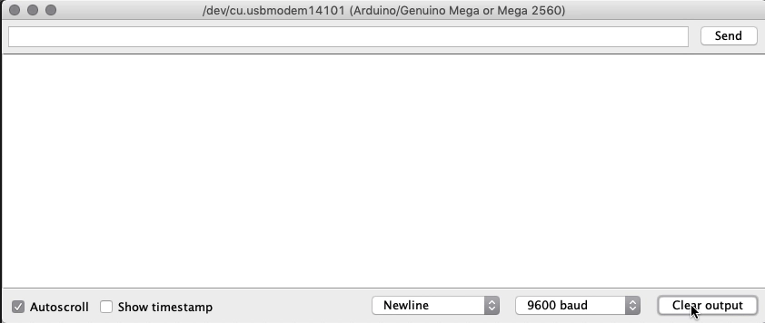

# Displays

## Color TFT LCD displays

TCT LCD (Thin-film-transistor liquid-crystal display) is a variant of LCD, that uses TFT tech to improve image quality.

### 1.8" Color TFT LCD display with MicroSD Card Breakout

Possessing 128 * 160 color pixels true TFT with full 18-bit color, this display can be used with any microcontroller.

There's internal logic that ensures you can use this  with 3.3 or 5v power and logic. They also have a microSD card holder for easy loading of Full Color Bitmaps, as long as the microSD is formatted with Fat16/32.

Lets start by knowing what each pin on the breakout does:

1. **Lite** - PWM input for the backlight control. Connect to 3-5VDC to turn on, to ground to turn it off or, you can PWM for intensity of the blacklight;
2. **MISO** - this is the SPI Master In - Slave Out pin, used for the SD card. It isn't used for the TFT display which is write-only;
3. **SCLK** - SPI clock input pin;
4. **MOSI** - SPI Master Out - Slave In pin, it is used to send data from the microcontroller to the SD card and/or TFT;
5. **TFT_CS** - TFT SPI chip select pin;
6. **Card_CS** - SD card chip select, used if you want to read from the SD card;
7. **D/C** - TFT SPI data or command selector pin;
8. **RST** - TFT reset pin. Connect to ground to reset the TFT! (It's best to have this pin controlled by the library so the display is reset cleanly, but you can also connect it to the Arduino Reset pin, which works for most cases) ;
9. **Vcc** - Power pin, connect to 3-5V DC - it has reverse polarity protection, however try to wire properly!
10. **GND** - Power and signal ground pi.

This color display uses SPI (Serial Peripheral Interface) to receive image data. That means you need at least 4 pins - clock, data in, TFT_CS and D/C. If you'd like to have SD card usage too, you need another 2 pins.

### SPI

Serial Peripheral Interface, is a common communication protocol for 2-way comms between 2 devices.
The master can talk to any slave on the bus, but each slave can only talk to the master.
Each slave on the bus has its own unique slave select signal. The master will use these signals to select which slave it is talking to.

SPI sets a clock signal, so the devices don't have to agree on a data rate beforehand (like you do with Serial by setting up Serial.begin() ), the clock only has to be lower than the max frequency for all devices involved.

#### Standard SPI bus
Consisting of 4 signals:
* Common to all devices:
  * Master Out Slave In (MOSI) - Master line for sending data to the peripheral;
  * Master In Slave Out (MISO) - Slave line for sending data to the master;
  * the clock (SCK) - synchronize data transmission generated by the master.
* Specific line for each device:
  * Slave Select (SS) -  pin on each device that the master can use to enable and disable that specific device.

#### SPI with Arduino
First of all; MISO, MOSI, and SCK are available in a consistent physical location on the ICSP header:

You can find the places for the headers in this schematic of the Mega, although you can also use some (specific) digital pins. the white dot means its the pin number 1 of ICSP. You can then refer to these pins as ICSP-1, 2, etc:

### Examples
In this section, we'll go over two basic examples, to learn the basics of using this screen with the Arduino.

First of all, you will need to install the following two libraries:
* Adafruit GFX (a graphics library);
* Adafruit_ST7735 (a library for the display).

#### TFT Screen Graphics Test
In this first example, let's run through all of the available graphics drawing functions of the Adafruit GFX library!

##### Schematic

###### Pins of the Screen Breakout (left to right):
* Gnd;
* Backlight (connect to Vcc);
* TFT Reset pin (connect to a digital pin, 3 in this case);
* TFT SPI data pin (connect to a digital pin, 4 in this case);
* Card CS, (connect to a digital pin, 5 in this case)
* TFT CS, (connect to a digital pin, 2 in this case);
* MOSI, (connect to SPI MOSI Hardware pin (SCPI-4));
* Clock, (connect to SPI Clock hardware pin (SCPI-3));
* Not used!
* Vcc pin.

##### Results
Once you've run the example program, you should see this in your serial!

#### Display Images on the TFT Screen by using a microSD card

In this program, we'll be displaying images in the screen (in bitmap image format)!
We will use the previous libraries, and Arduino's SD library!

Start by converting some images to 160x128 24bit color bitmap format, and placing them in a FAT16/32 formatted microSD card, and placing that in the SD card holder. You can find some bitmap files in the Example folder, and put those in the SD card

##### Schematic

###### Pins of the Screen Breakout (left to right):
* Gnd;
* Backlight (connect to Vcc);
* TFT Reset pin (connect to a digital pin, 3 in this case);
* TFT SPI data pin (connect to a digital pin, 4 in this case);
* Not used!
* TFT CS, (connect to a digital pin, 2 in this case);
* MOSI, (connect to SPI MOSI Hardware pin (SCPI-4));
* Clock, (connect to SPI Clock hardware pin (SCPI-3));
* MISO pin (connect to MISO hardware pin (SCPI-1));
* Vcc pin.

#####  Results
You should see this in your console at the end!

