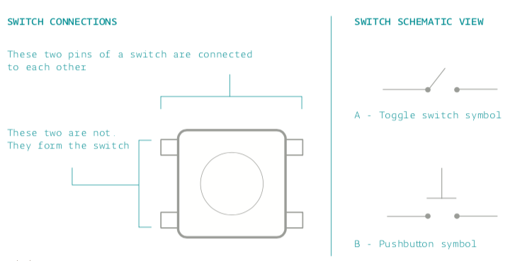

##LEDs
An LED is a type of diode that emits light. A diode is, simply, a device that lets current go through it in one direction, but resists it in the other. To pass current through the diode in the direction it does not resist (anode to cathode), you need to supply some voltage to it. An LED normally spends from 1.8 to 3.3 volts, depending on the particular type, this is called its voltage drop or forward voltage. The current that the LED spends nominally is called forward current.  With LEDs you have to be careful  to not supply too much current to an LED, or else you might fry it!.
That's why you'll see that normally you have a resistor in series with the LED, to assure that not too much current goes through it.

By knowing the forward current and voltage of an LED, and the available power source's voltage, you can calculate how big the resistor you apply in series should be. the formula is a simple derivation of ohm's law (V = RI)

Rs = ( Vcc - Vf ) / If
1. Rs = Resistance in series with LED
2. Vcc = power source's voltage
3. Vf = forward  voltage of the LED
4. If = forward current of the LED

If you have several LEDs in series with similar forward currents, you can simply replace Vf with the sum of all forward voltages of the LEDs.

## Pushbutton Switch
A pushbutton switch, is a very simple electronic device with 4 pins. When left to itself (open), there is no electrical connection between the two sets of pins. When a switch is pressed, it will close its metallic contact on the two sets of pins, thus allowing current to pass between the 2 sets of 2 pins.

Here's a brief schematic (note, a set of pins means those pins are always connected, you can see the sets in black, and the ):

