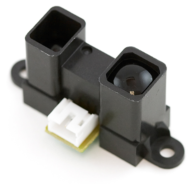

# Proximity Sensors

## Infrared Proximity Sensors
IR sensors are proximity sensors that use  Infrared rays to  measure distance to objects. This is done by blasting the ray, catching the reflection and calculating the distance between the two objects! Can be used for detecting objects, obstacle detection, and other applications!

###  Sharp GP2Y0A02YK0F Long Range
This IR proximity sensor made by Sharp is good for sensing objects up to 1.5m away and, in our case, comes with a Japanese Solderless Terminal(JST) connector. This connector has three wires:
* Red - to connect to $V_{cc}$;
* Black - to connect to Ground;
* Yellow - Analog Output.

#### Technical Details

* Supply voltage  between [4.5 - 5.5]V;
* Analog output 2.8V (15 cm), to 0.4V(150cm);
* Distance Measuring Range [20 - 150]cm;
* Non linear (exponential) relation between distance and voltage;
* Consumption current : Typ. 33 mA;

Just like we did with the Pressure Sensor, the relation between distance and voltage is also not linear. A curve fitting was done over measured distances to have an estimate of the distance from the voltage measurements.

#### Examples

##### Proximity sensor
We will make a simple proximity sensor, with continuous distance measurements:

###### Schematic

###### Results
This is how your console should look like!

