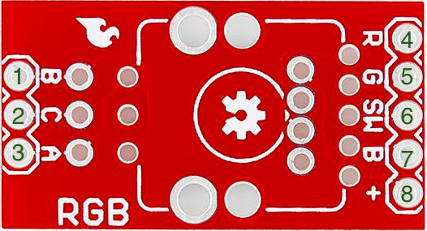

### Sparkfun RGB rotary encoder

Encoders can measure the rotation of a shaft. there are two main types :
* Absolute - this type of encoders relate information about the absolute position of the shaft;
* Incremental - this type of encoders relate information on the relative motion of the shaft of the encoder, i.e. changes in the position of its shaft, but not its absolute position.

The Sparkfun RGB rotary encoder is one of the most common types for general electronics, a quadrature rotary encoder (a type of incremental encoder), and is rather similar to a potentiometer, however its rotation is infinite is both directions. It also possesses full RGB illumination of the shaft, with the shaft also doubling as a clickable button.

#### Functionality

This encoder is conveniently soldered into a breakout board, for easy use with a breadboard and access of its I/O.  With the help of the following diagram we can see how this encoder works.

1. B contact, one of the data pins;
2. "Common" contact - to be connected to ground;
3. A contact, another of the data pins;
4. Input to Red LED;
5. Input to Green LED;
6. "Switch" contact, LOW by default, switches to HIGH when shaft is clicked;
7. Input to Blue LED;
8. "Vcc" connector, to be connected to 3.3V.

Let's review how an rotary encoder works:

the code examples uses interrupts, be sure to explain how they work.

explain pull up and pull down
