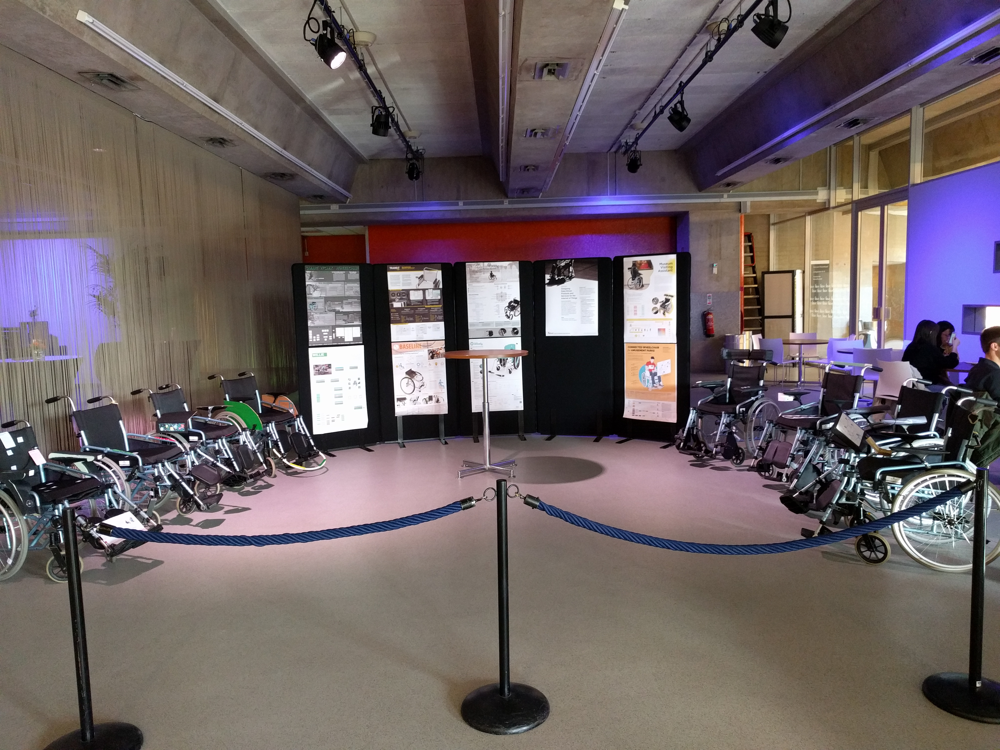
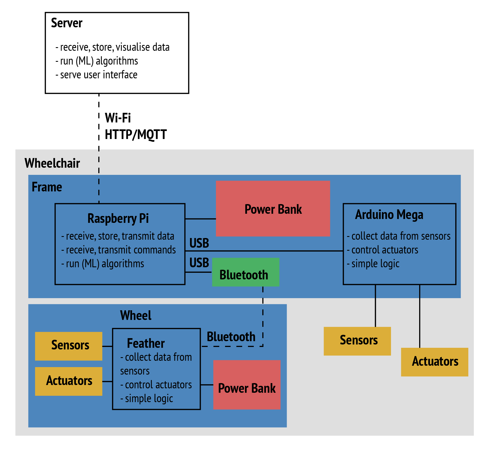

Wheelchair Design Platform is a repository that contains some resources to help
designers and developers speak the same language, and work together towards
addressing relevant challenges for wheelchair users. It is a collection of
workshop materials, code examples and also a compilation of resources to foster
a prospering research and design community around wheelchair users.

## Workshops

* [Getting started](workshops/GettingStarted.md)
* [Workshop 1: Building an Internet-Connected Wheelchair](workshops/Workshop1.md)
* [Workshop 2: Integrating and Visualising Sensor-Based Data](workshops/Workshop2.md)
* [Workshop 3: Developing Algorithms and Controlling Actuators](workshops/Workshop3.md)
* [Workshop 4: Developing and Conducting a Data Collection Campaign](workshops/Workshop4.md)
* [Workshop 5: Implementing a Machine Learning Pipeline](workshops/Workshop5.md)
* [Workshop 6: Developing a Product Analytics Dashboard](workshops/Workshop6.md)

## Resources

* This platform uses two programming languages, Python on computers and C on
micro-controllers. While descriptions and examples of code should help you
get started, you can find some additional resources
[here](resources/software.md).

* Documentation of your project is key,
[here are some tips and examples](resources/documentation.md).

* [Git manipulation such as Pull Requests](resources/git.md).

## Main Components

__**Disclaimer:**__ the design of this platform focuses on flexibility and
technology exploration rather than optimization\.

The main design includes a Raspberry Pi 3 and an Arduino Mega 2560 on the wheelchair frame.

The Arduino Mega is the micro-controller of the platform. Fixed on the main frame of the wheelchair,
it can collect data from sensors (e.g. force sensors, accelerometers), and trigger actions from actuators
(e.g. LEDs, vibration motors).

More on the Arduino Mega can be found [here](resources/arduino.md "Arduino resources").

Raspberry Pi is a small computer. It is also fixed to the main frame of the wheelchair,
where it can:
* interact with the Arduino Mega via USB to receive data and transmit commands;
* interact with the Internet to transmit commands and receive data;
* store data locally in files;
* run (machine learning) algorithms.

More on the Raspberry Pi can be found [here](resources/raspberrypi.md "Raspberry Pi resources").

These components fit together as shown on the following diagram. A large powerbank
powers the Raspberry Pi. The Arduino Mega communicates and receives power from the
Raspberry Pi via USB. A Feather (Arduino-like development board) on the wheel connects to
the Raspberry Pi via Bluetooth to sense and actuate from the wheel.

## List of suggested components:

On the frame:

* 1 Raspberry Pi 3B+;
* 1 SD card (Some come directly with NOOBS installed);
* 1 Arduino Mega;
* 1 Large power bank;
* 1 large breadboard;
* 1 USB cable A/micro (Powerbank to Raspberry Pi);
* 1 USB cable A/B (Raspberry Pi to Arduino Mega).

On the wheel:

* 1 Feather 32u4 (Bluetooth enabled);
* 1 small power bank;
* 1 small breadboard;
* 1 USB cable A/B (power bank to Arduino Uno).

## Contact and Existing projects

* [The hiking wheelchair](https://github.com/cprecioso/wheelchair-design-platform)
* [The EDU wheelchair](https://github.com/ctsai-1/wheelchair-design-platform)
* [Weelchair tracking for basketball players](https://github.com/FabianIDE/wheelchair-design-platform)
* [Disco Wheelchair](https://github.com/MatthijsBrem/wheelchair-design-platform)
* [Wheelchair Madness 2222](https://github.com/pherkan/wheelchair-design-platform/tree/master/wheelchair)
* [Who is sitting?](https://github.com/Rosanfoppen/wheelchair-design-platform/tree/master/wheelchair)
* [Magic Wheelchair](https://github.com/Yuciena/wheelchair-design-platform)
* [Yoga Wheelchair](https://github.com/artgomad/wheelchair-design-platform)

Feel free to contact us at jacky@datacentricdesign.org. We welcome feedback, pull requests
or links to your project.
