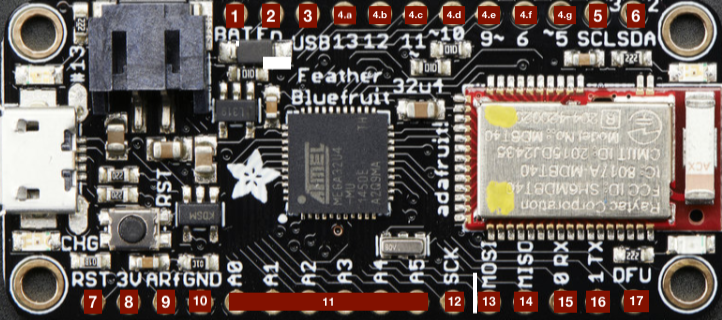

# Adafruit Feathers
The Adafruit Feather is a complete line of development boards that are both 
standalone and stackable.

## Bluetooth
Bluetooth is a wireless technology standard for exchanging data over short 
distances using short-wavelength UHF radio waves (ISM band of the wave spectrum
- from 2.400 to 2.485 GHz). From these waves, that originate from fixed and
mobile devices, PANs (personal area networks) are built.

**BTLE**
Bluetooth Low Energy is a new low-power, 2.4GHz spectrum wireless protocol. In 
particular, its the only wireless protocol that you can use with iOS without
needing special certification and it's supported by all modern smart phones.
This makes it excellent for use in portable projects that will make use of an
iOS or Android phone or tablet. It also is supported in Mac OS X and Windows 8+.

### PANs
A personal area network (PAN) is a computer network for interconnecting devices
centered on an individual person's workspace. A PAN provides data transmission
amongst devices such as computers, smartphones, tablets and personal digital
assistants.

PANs can be used for communication amongst the personal devices themselves, or
for connecting to a higher level network and the Internet where one master
device takes up the role as gateway. A PAN may be wireless or carried over
wired interfaces such as USB.

A wireless personal area network (WPAN) is a PAN carried over a low-powered,
short-distance wireless network technologies such as Bluetooth. The reach of a
WPAN varies from a few centimeters to a few meters.

### Adafruit Feather 32u4 Bluefruit
The Adafruit Feather 32u4 Bluefruit is an 'all-in-one' Arduino-compatible + Bluetooth
Low Energy(BLTE) board with built in USB and battery charging. It's an Adafruit
Feather 32u4 with a BTLE module.

#### Pins
1. **BAT** - positive voltage to/from JST jack for optional Li-Po battery;
2. **EN** - 3.3V regulator's enable pin. has pull up, connect to ground 
to disable regulator;
3. **USB** - Positive voltage to/from microUSB jack, if connected;
4. **Pins 13-5**
    * **.a** - GP(General Purpose)I/O 13, can do PWM output, is connected to red
    LED next to USB port;
    * **.b** - GP I/O 12, also analog input A11;
    * **.c** - GP I/O 11, can do PWM output;
    * **.d** - GP I/O 10, can do PWM output and can also be analog input A10;
    * **.e** - GP I/O 9, can do PWM output and can also be analog input A9,
    analog input is connected to a  voltage divider for Li-Po battery, so naturally
    'sits' at 2V DC due to the resistor divider;
    * **.f** - GP I/O 6, can do PWM output and can also be analog input A7;
    * **.g** - GP I/O 5, can also do PWM output;
5. **SCL** - GP I/O 3, can do PWM output , and act as interrupt 0. Also the I2C
clock pin, has no pullup by default, so when using I2C, may need 2.2-10kΩ pullup;
6. **SDA** -  GP I/O 2, can do PWM output , and act as interrupt 1. Also the I2C
data pin, has no pullup by default, so when using I2C, may need 2.2-10kΩ pullup;
7. **RST** - Reset pin, can be tied to ground to manually reset the AVR, as well
as launch the bootloader manually;
8. **3V** - Output from 3.3V regulator, supplies 500mA at peak;
9. **ARf** - ARef, the analog reference pin. Normally the reference voltage is
the same as the chip logic voltage (3.3V). If an alternative analog reference
is needed, the pin must be connected to it, and then,  the external AREF in the
firmware needs to be selected. Upper limit of (3.3V);
10. **GND** - Common Ground for the board;
11. **A0-A5** - Analog as well as digital I/O pins;
12. **SCK** - SPI clock input pin, should be kept available for the bluefruit;
13. **MOSI** - SPI Master Out - Slave In pin, should be kept available for the
bluefruit, can also be used to reprogram the chip with an AVR(family of 
microcontrollers) programmer;
14. **MISO** - SPI Master In - Slave Out pin, used by Bluefruit LE module,
should be kept available for the bluefruit;
15. **0 RX** - GP I/O 0, can also receive (input) pin for Serial 1, and interrupt 2;
16. **1 TX** - GP I/O 1, can also receive (output) pin for Serial 1, and interrupt 3;
17. **DFU** - Force-DFU (device firmware upgrade) pin for over-the-air updates
to the Bluefruit module. Most likely will not be used, so, in general, keep
disconnected (but it is available).

#### Technical details
The main structure of this board specifies a main processor (which is an ATmega32u4
in our case) and a co-processor module which is the red and silver rectangle,
containing an nRF51 chip which can only do Bluetooth Low Energy.

The nRF51 is programmed with the Bluefruit firmware, and can be controlled with AT
commands over an SPI connection. When the main processor (32u4) wants to send or
receive BLE(Bluetooth Low Energy) data, it sends commands to the co-processor
module. However, this solution can only act as a peripheral, not as a central
device, it has a  bit more power draw, does not take advantage of the newer nRF52
capabilities, and cannot use bluetooth classic.
This board can be connected to 3.7V Li-Po batteries or the through the USB port.
It will automatically switch over to USB power when its available.

* ATmega32u4 processor @ 8MHz with 3.3V logic/power;
* 3.3V regulator with 500mA peak current output;
* USB native support, comes with USB bootloader and serial port debugging;
* 20x GPIO pins;
* Hardware Serial, I2C, and SPI support;
* 7x PWM pins;
* 10x analog inputs
* Built in 100mA lipoly (lithium polymer) charger with charging status indicator LED;
* Pin #13 connected to red LED for general purpose blinking;
* Power/enable pin;
* Reset button;

Whenever we want to have sensors wirelessly sending data, we will use this board
as its µcontroller. For that, we can start with setting up how to add this board
to the Arduino IDE.

#### Setup with Arduino IDE

Inside of the Arduino IDE, we can go to Arduino -> Preferences (circled in red):

Once inside the Preferences menu we will have to add an additional Board Manager
URL. We will do that by pressing the button (circled in Red):

Note that each link should be in a separate row (in case you have other board URLs
installed). The link you should add (without quotes) is:
"https://adafruit.github.io/arduino-board-index/package_adafruit_index.json".

After pressing ok, we can now head into the Boards Manager ( Tools > Board:... >
Boards Manager...):

Once inside we will search "Adafruit", and the Adafruit AVR Boards package should 
appear. We will then install the latest version. This package contains a bunch of
AVR boards from Adafruit, including our own Feather:

After this, we should have our Adafruit Feather 32u4 Board available in the boards
submenu option (Tools -> Board:... -> Adafruit Feather 32u4):

After selecting it, we should be ready to compile code for, and flash it through
the Arduino IDE! This board is fully compatible with Arduino, so the code in the
Arduino examples can be used (with only some minor port and power wiring adaptations,
as this is a 3.3V board, and also has less ports than the mega) :

