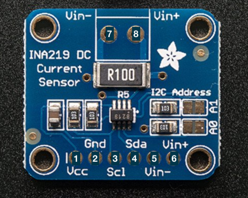
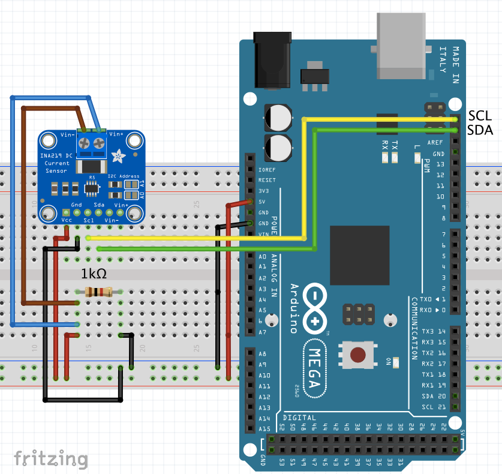
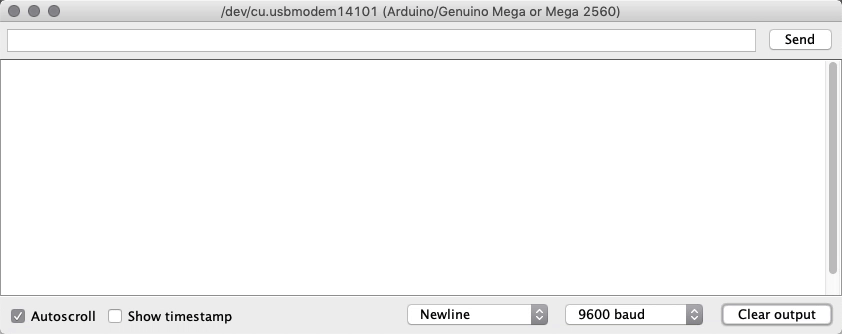

# Current & Voltage Sensors

These are Integrated sensors that detect both the current, and the voltage (then, following Ohm's law, the power) of a circuit.

The most common method for measuring currents in electronic circuits is to place low-value sense resistors in series with the load and measure the voltage drop across them.

## INA219 High Side DC Current Sensor

This breakout board allows for power monitoring, including both a High side voltage and DC current draw sensor over I2C.

High-side and low-side current sensing refers to the placement of the current-sense resistor:
* High Side - between the positive supply and the load (whatever is being driven by the circuit);
* Low Side - between the load and ground.

### Pins
1. Ground;
2. Vcc, power with 5V;
3. SDA data pin;
4. SCL clock pin;
5. Vin- terminal (if you want to use another current sensor);
6. Vin+ terminal (if you want to use another current sensor);
7. Vin- of INA219 DC current sensor;
8. Vin+ of INA219 DC current sensor;

### Technical Details
* 1% precision;
* High Side measurement, up to +26V DC;
* Powered with 3-5V;
* Uses precision amplifier to measure voltage across 0.1Ω , 1% sense resistor;
* Can measure up to ±3.2A (since internal amplifier has maximum input resolution of ±320mV);
* Internal 12bit ADC( Analog to Digital converter);
* Resolution  of 0.8mA at ±3.2A range.

This breakout requires the use of the library Adafruit INA219.

Now lets see a list of terms for the sensor:
* Bus voltage - voltage between GND and V-, total voltage seen by circuit under test. (supply voltage - shunt voltage);
* Shunt voltage - voltage between V- and V+, voltage drop across the shunt resistor;

### Examples

#### Power sensor of a simple Circuit
We'll be making use of all the basic functionalities of this breakout to do some simple measurements of a basic circuit!

##### Schematic

##### Results
Now, let's see what our console should look like:

