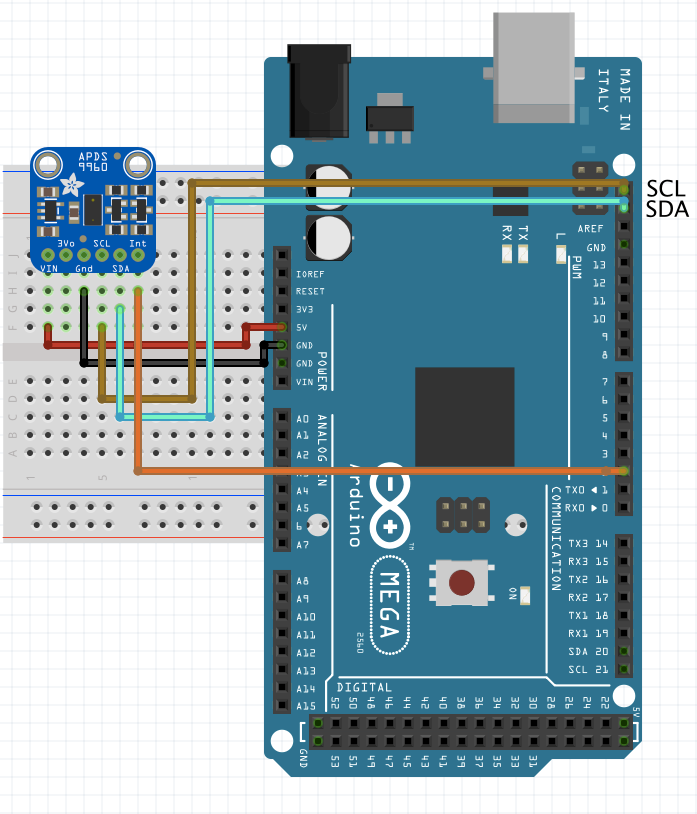
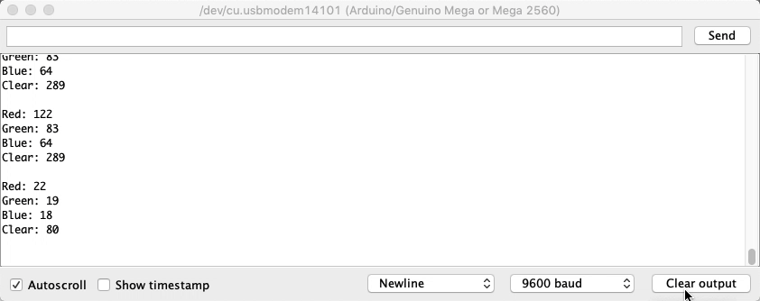

# Light and color

## Adafruit APDS9960

This breakout has a lot of integrated sensors, and allows the addition of basic gesture sensing (left, up, down, right), RGB color sensing (detect amount of R, G, B light), proximity sensing (how close an object is to the front of the sensor), and Ambient light sensing (how much clear light).

### Pins
1. Vin, (3-5V);
2. 3.3V output from internal voltage regulator, may supply up to 100mA, if needed;
3. Gnd;
4. SCL, clock pin of I2C;
5. SDA, data pin of I2C;
6. Interrupt output pin, can be used to detect new reading is ready, gets too high, or gets too low;
7. Proximity detection up to ≈ 15-20cm.

This breakout uses the Library Adafruit APDS9960 library.

### Technical Details
* Can be used with both 3.3 and 5v µcontrollers;
* Has Integrated IR LED driver, with 4 directional photodiodes;
* Proximity sensor for objects in front of sensor (up to a few centimeters), with 8bit resolution;
* With 4 IR sensors, changes in light reflectance in each cardinal direction can be measured and used for gesture detection;
* Possesses configurable interrupt that can fire when a proximity threshold is broken, or when a color sensor reaches a certain threshold.

### RGBC Color Sensing
In this example we're going to test the RGB color sensing features of the board!

#### Schematic

#### Results

