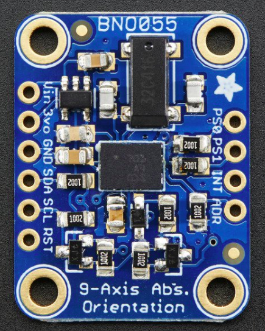
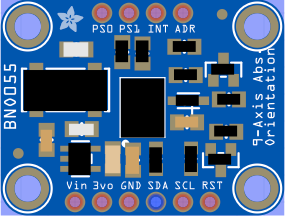
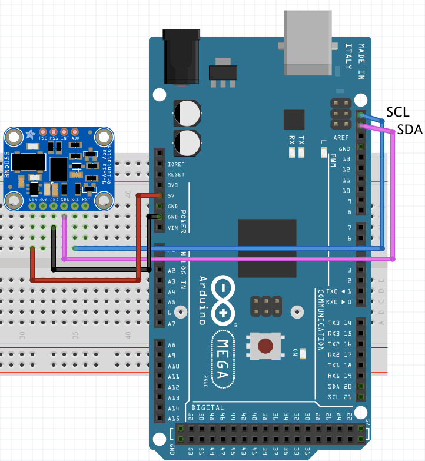
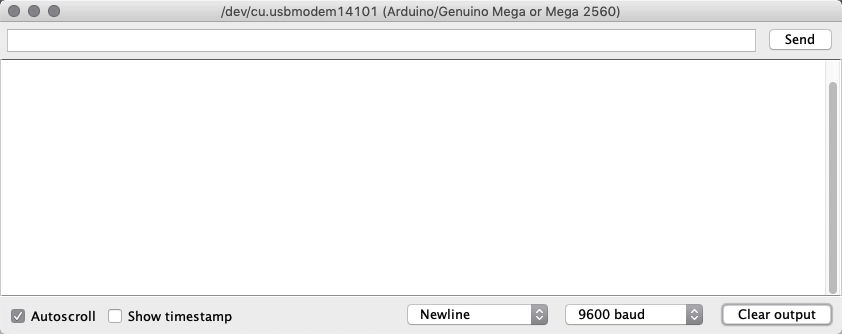
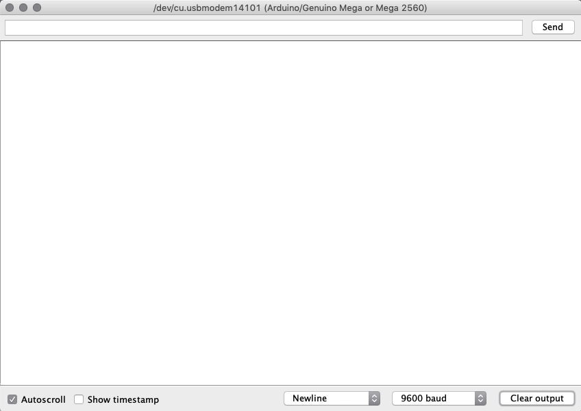
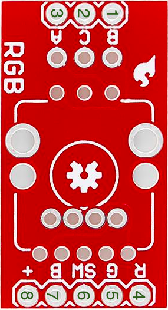
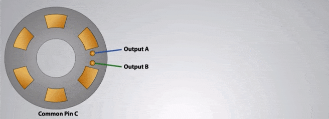
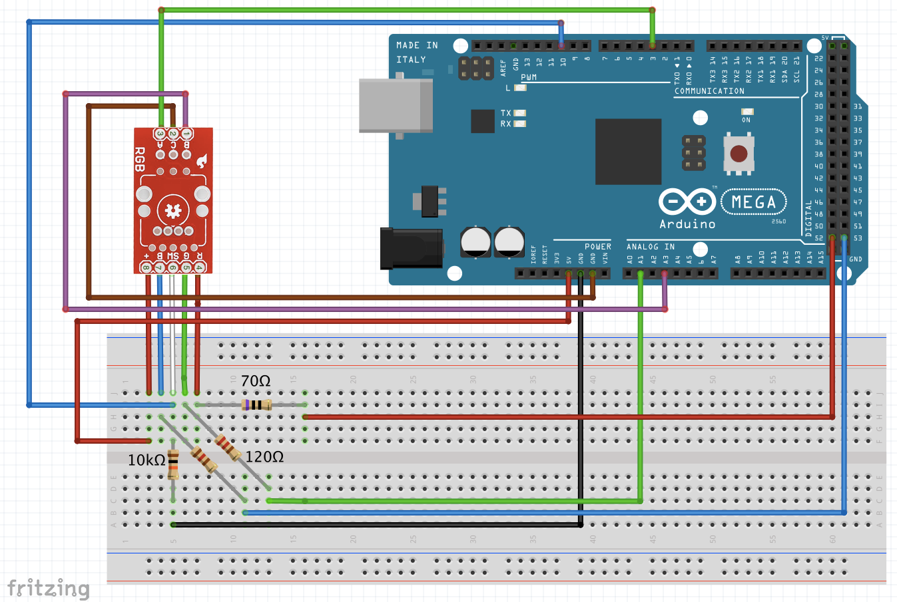

# Orientation Sensors

These sensors serve to provide orientation data, and they normally mix several
different sensors such as accelerometers, gyroscopes and magnetometers.

## BNO055 Intelligent 9-axis absolute orientation sensor

This 9-DOF (Degrees of freedom) sensor turns the sensor data from an accelerometer,
gyroscope and magnetometer into 3D space orientation.
These so called sensor fusion algorithms that blend accelerometer, magnetometer and
gyroscope data into stable three-axis orientation output can be difficult to
implement on low cost real time systems.

The BNO055 manages to get this right by taking a MEMS (Microelectromechanical
systems) accelerometer, magnetometer and gyroscope and putting them on a single
die with a high speed ARM Cortex-M0 based processor to process all the sensor data,
abstract away sensor fusion and real time requirements, and output data you can
use in quaternions, Euler angles or vectors.

### Technical details

This Sensor will require the use of the Adafruit Unified Sensor (Adafruit_Sensor),
and Adafruit BNO055 libraries.

The data from this board can be accessed in several formats, namely:

* Absolute Orientation (Euler Vector, 100Hz) - Three axis orientation data based on a 360° sphere;
* Absolute Orientation (Quaternion, 100Hz) - Four point quaternion output for more accurate data manipulation;
* Angular Velocity Vector (100Hz) - Three axis of 'rotation speed' in rad/s;
* Acceleration Vector (100Hz) - Three axis of acceleration (gravity + linear motion) in m/s^2;
* Magnetic Field Strength Vector (20Hz) - Three axis of magnetic field sensing in micro Tesla (uT);
* Linear Acceleration Vector (100Hz) - Three axis of linear acceleration data (acceleration minus gravity) in m/s^2;
* Gravity Vector (100Hz) - Three axis of gravitational acceleration (minus any movement) in m/s^2;
* Temperature (1Hz) - Ambient temperature in degrees celsius;

### Pins

Now, lets see what each pin of this board is for:

* **Vin** - 3.3-5.0V power supply input;
* **3vo** - 3.3V output from internal voltage regulator, may supply up to 500mA, if needed;
* **GND** - The common/GND pin;
* **SDA** - I2C data pin, can be used with 3V or 5V logic, and there's a 10K pullup on this pin;
* **SCL** -  I2C clock pin, can be used with 3V or 5V logic, and there's a 10K pullup on this pin;
* **RST** - 5V safe hardware reset pin. Can be set to low, then high to cause a reset on the sensor;
* **PS0 & PS1** - These pins can be used to change the mode of the device (it can
also do HID-I2C (HID (Human interface device) over I2C) and UART (Universal asynchronous
receiver-transmitter)), and also are provided in case Bosch provides a firmware update
at some point for the ARM Cortex M0 MCU inside the sensor. They should normally
be left unconnected;
* **INT** - 3V voltage level hardware interrupt output pin, can be configured to
generate an interrupt signal upon certain events, like movement detected by the
accelerometer, etc. (not currently supported in the Adafruit library, but the chip
and HW (hardware) is capable of generating this signal);
* **ADR** - this pin can be set to high to change the default I2C address for the
BNO055, if you need to connect two ICs on the same I2C bus. The default address is
0x28. If this pin is connected to 3V, the address will be 0x29.

### Examples

##### Schematic (for all examples)

#### Basic Three Axis orientation data (in Euler angles)

In this example, simple orientation data in the form of Euler Angles is given.

##### Euler Angles

Euler angles are three angles introduced by Leonhard Euler to describe the
orientation of a rigid body with respect to a fixed coordinate system.
Any orientation can be achieved by composing three elemental rotations, i.e.
rotations about the axes of a coordinate system. Euler angles can be defined
by three of these rotations.

<a href="https://github.com/datacentricdesign/wheelchair-design-platform/tree/master/examples/sensors/orientation/bno055_euler_angles" target="_blank">Source code</a>

###### Geometrical definition

The axes of the original frame are denoted as x, y, z and the axes of the rotated
frame as X, Y, Z. The geometrical definition (sometimes referred to as static)
begins by defining the line of nodes as the intersection of the planes xy and XY.

Using it, the three Euler angles can be defined as follows:
 ⍺ (or φ) β- is the angle between the x axis and the N axis (x-convention - it
 could also be defined between y and N, called y-convention).
 * β (or ϴ) is the angle between the z axis and the Z axis.
 * ɣ (or Ψ) is the angle between the N axis and the X axis (x-convention).

##### Results
Here's how your console should look in the end:

#### Basic Three Axis raw data

In this example, all types of possible raw data from the IMU are given.

<a href="https://github.com/datacentricdesign/wheelchair-design-platform/tree/master/examples/sensors/orientation/bno055_raw_data" target="_blank">Source code</a>

##### Results
Here's how your console should look in the end:

#### Basic Rotation calculations

In this example, the total number of rotations, both forward and reverse since
the beginning of the activation of the IMU are computed.

<a href="https://github.com/datacentricdesign/wheelchair-design-platform/tree/master/examples/sensors/orientation/bno055_rotations" target="_blank">Source code</a>

##### Results
Here's how your console should look in the end:

## Sparkfun RGB rotary encoder

Encoders can measure the rotation of a shaft. There are two main types of encoders:

* Absolute - this type of encoders relate information about the absolute position
of the shaft;
* Incremental - this type of encoders relate information on the relative motion
of the shaft of the encoder, i.e. changes in the position of its shaft, but not
its absolute position.

The Sparkfun RGB rotary encoder is one of the most common types for general
electronics, a quadrature rotary encoder (a type of incremental encoder), and is
rather similar to a potentiometer; however its rotation is infinite in both
directions. It also possesses full RGB illumination of the shaft, with the shaft
also doubling as a clickable button.

### Functionality

This encoder is conveniently soldered into a breakout board, for easy use with a
breadboard and access of its I/O.  With the help of the following diagram we can
see how this encoder works.

1. B contact, one of the data pins;
2. "Common" contact - to be connected to ground;
3. A contact, another of the data pins;
4. Input to Red LED;
5. Input to Green LED;
6. "Switch" contact, LOW by default, switches to HIGH when shaft is clicked;
7. Input to Blue LED;
8. "Vcc" connector, to be connected to 3.3V.

Let's review how an rotary encoder works:

The incremental rotary encoder works in a very simple way. There are 3 terminals,
where C is the common, which is connected to ground. The rotary encoder also has
metallic contacts connected to VCC. As you can see, the data pins are phased 
between each other, and during the turning of the wheel, when the pin touches 
the contact it will be 1, and 0 for when it touches the ground. The data streams 
are shifted 90˚(hence quadrature) from each other (since there's a particular 
distance between the contacts).
Why use two data streams? Well to figure out which direction we're turning it, 
since you can tell which data stream comes first!

#### Diagram of the circuit
Here follows a diagram of a test circuit using the Arduino Mega.
The LEDS  current is 25 mA. They have the following forward voltages(voltage
drop), so if you are using a different Vcc than 5V, you must calculate other
resistances (check the LED tutorial):

R : 2V
G : 3.3V
B : 3.3V

#### Results

Now you should have a working RGB encoder! Below you can find what your serial
output should look like:

