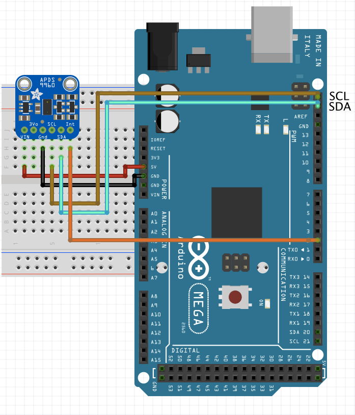

# Proximity Sensors

## Infrared Proximity Sensors

IR sensors are proximity sensors that use  Infrared rays to  measure distance to 
objects. This is done by blasting the ray, catching the reflection and calculating 
the distance between the two objects! Can be used for detecting objects, obstacle 
detection, and other applications!

###  Sharp GP2Y0A02YK0F Long Range

This IR proximity sensor made by Sharp is good for sensing objects up to 1.5m 
away and, in our case, comes with a Japanese Solderless Terminal(JST) connector.
This connector has three wires:

* Red - to connect to $V_{cc}$;
* Black - to connect to Ground;
* Yellow - Analog Output.

#### Technical Details

* Supply voltage  between [4.5 - 5.5]V;
* Analog output 2.8V (15 cm), to 0.4V(150cm);
* Distance Measuring Range [20 - 150]cm;
* Non linear (exponential) relation between distance and voltage;
* Consumption current : Typ. 33 mA;

Just like we did with the Pressure Sensor, the relation between distance and 
voltage is also not linear. A curve fitting was done over measured distances 
to have an estimate of the distance from the voltage measurements.

#### Examples

##### Proximity sensor
We will make a simple proximity sensor, with continuous distance measurements:

###### Schematic

###### Results
This is how your console should look like!

## Adafruit APDS9960

This breakout has a lot of integrated sensors, and allows the addition of basic
gesture sensing (left, up, down, right), RGB color sensing (detect amount of R, 
G, B light), proximity sensing (how close an object is to the front of the 
sensor), and Ambient light sensing (how much clear light).

### Pins
1.  Vin, (3-5V);
2.  3.3V output from internal voltage regulator, may supply up to 100mA, if needed;
3.  Gnd;
4.  SCL, clock pin of I2C;
5.  SDA, data pin of I2C;
6.  Interrupt output pin, can be used to detect new reading is ready, gets too high, or gets too low;
7. Proximity detection up to ≈ 15-20cm.

This breakout uses the Library Adafruit APDS9960 library.

### Technical Details
* Can be used with both 3.3 and 5v µcontrollers;
* Has Integrated IR LED driver, with 4 directional photodiodes;
* Proximity sensor for objects in front of sensor (up to a few centimeters), with 8bit resolution;
* With 4 IR sensors, changes in light reflectance in each cardinal direction can be measured and used for gesture detection;
* Possesses configurable interrupt that can fire when a proximity threshold is broken, or when a color sensor reaches a certain threshold.

#### Proximity sensor
In this example we're going to test the proximity features of the board!

##### Schematic

##### Results

