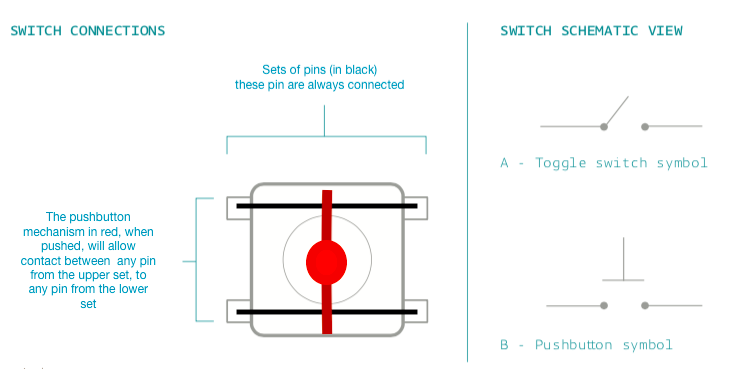

# Pushbutton Switch

A pushbutton switch, is a very simple electronic device with 4 pins. When left
to itself (open), there is no electrical connection between the two sets of pins.
When a switch is pressed, it will close its metallic contact on the two sets of
pins, thus allowing current to pass between the 2 sets of 2 pins.

Here's a brief schematic (note, a set of pins means those pins are always connected,
you can see the sets in black, and the mechanism to join them electrically when
you press the button in red):

