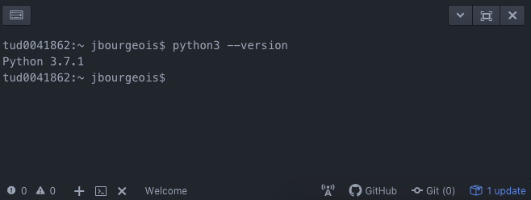

# Getting Started

In this tutorial, you will setup a development environment for Python and Arduino.

## 1. Atom

The first tool we need is a code editor, commonly called IDE (integrated
development editor). For this we will use Atom, as it is open source and popular
for its modularity.

Download and start Atom <a href="https://atom.io/" target="_blank">here</a>.

Atom has the typical features of an IDE, we will go through them during this workshop.
The first of them is the terminal. A terminal is a text-based interface we use
to enter and execute commands on a computer. While we will maximize the use of
graphical tools, we will also use the terminal in some occasions.

On the top menu, go to Packages > Settings View > Install Packages/Themes

Search for 'terminal plus' and install the first one 'platformio-ide-terminal'

Now you can open a terminal by clicking on the + sign in the bottom left corner.

## 2. Python

Python is the main programming language we will use throughout this course. To
execute Python code on your machine, you need to install a Python interpreter.
We will use Python 3.x (as opposed to 2.x).

In Atom, open a terminal and type in the following command to check if Python is
installed on your laptop with the appropriate version.

On Mac, type in

```bash
python3 --version
```

On Windows, type in:

```bash
python --version
```

If Python 3 is installed, the result should look as follows:



If the command results are 'Command Not found' (or an equivalent message), you need
to install Python 3. Otherwise, skip to section 2.2.

### 2.1 Install Python

Select, download and install the latest version of Python 3 for your system
<a href="https://www.python.org/downloads/release/python-372/" target="_blank">here</a>.

#### Windows

Once installed, go to 'Start > System > Properties > Advanced System Properties >
Environment Variable' In User Variables, double click on 'Path'. At the end of
the line, add a semi-colon (;<zero-width space>), followed by:


C:\Users\YOUR_USERNAME\AppData\Local\Programs\Python\Python37;C:\Users\YOUR_USERNAME\AppData\Local\Programs\Python\Python37\Scripts

(Replace YOUR_USERNAME with your Windows user name)

Close and reopen the Atom to check the installation, by typing in your console:

```bash
python --version
```

And verifying that the correct version of python was installed.

#### Mac

After installation, close and reopen the Atom to check if it was successful, by typing the following on your console:

```bash
python3 --version
```

if the correct version of python is shown, the install was successful.

### 2.2 Python Dependencies

In the Python ecosystem, Pip is a tool that manages packages for us. We will use
it to install and update any Python library our project relies on. You can check whether
Pip is already install with the following command.

On Mac, type in:

```bash
python3 -m pip --version
```
On Windows, type in:

```bash
python -m pip --version
```

If it is not found, you can install it as follows.

On Mac, type in:

```bash
python3 get-pip.py
```

On Windows, download the file <a href="https://bootstrap.pypa.io/get-pip.py" target="_blank">get-pip.py</a>
and save it (CMD+S or Ctrl+S) in your Downloads folder. In the Atom terminal, type in the
following command:

```bash
python Downloads\get-pip.py
```

### 2.3 Python in Atom

The next step is the Python plugin for Atom, to get some help specifically for
Python in Atom. Go to the terminal and type:

On Mac, type in:

```bash
python3 -m pip install 'python-language-server[all]'
```

On Windows, type in:

```bash
python -m pip install 'python-language-server[all]'
```

When it is installed, on the top menu of Atom, click on *'Packages' >
'Settings View' > 'Install Packages/Themes'*. Search and install 'atom-ide-ui'
and 'ide-python'.

If you do not have experience with Python, we recommend you to go through the following tutorial
to get started: <a href="http://www.learnpython.org/" target="_blank">http://www.learnpython.org/</a>


## 3 Git & GitHub

Git is a version control system (VCS). It helps to keep track of all the  changes
in your project and sharing these. While it is heavily used by software developers to
track and share code, it is also useful to track and share the progress of any
design or research process. The principle is as follows: you share a remote
repository, you 'pull' the latest changes (any files, code, doc...) from your
peers from this repository, you make changes on your machine, and you 'push' your
changes on the remote repository, making them available to your peers.

Here are four short videos with more details:

* <a href="https://git-scm.com/video/what-is-version-control" target="_blank">What is version control</a>
* <a href="https://git-scm.com/video/what-is-git" target="_blank">What is git</a>
* <a href="https://git-scm.com/video/get-going" target="_blank">Get Going</a>
* <a href="https://git-scm.com/video/quick-wins" target="_blank">Quick wins</a>


### 3.1 Install Git

Download and install Git from <a href="https://git-scm.com/download" target="_blank">here</a>.

GitHub is a popular online platform that hosts remote Git repositories.
We will use it throughout the course to host your repo.

### 3.2 Sign up on GitHub

If you do not have GitHub account, sign up
<a href="https://github.com/" target="_blank">here</a>.


## 4 Install Arduino IDE

Similar to Atom, the Arduino IDE is an editor with a convenient set of tools to program
Arduino-like devices. You can download and install the latest version from
<a href="https://www.arduino.cc/en/Main/Software" target="_blank">here</a>.
