# Workshop 1: Building an Internet-connected Wheelchair

1. [Git Flow](#1-git-flow)
2. [Data-Centric Data Hub](#2-data-centric-design-hub-per-group)
3. [Run Python Example](#3-run-python-example)
4. [Data Collection with Arduino](#4-data-collection-with-arduino)
5. [Setting up the Raspberry Pi](#5-setting-up-the-raspberry-pi)


# 1 Git Flow

### 1.1 Fork Wheelchair Design Platform repository (only one member of the group)

*'A fork is a copy of a repository. Forking a repository allows you to freely
experiment with changes without affecting the original project.'*
<a href="https://help.github.com/articles/fork-a-repo/" target="_blank">(GitHub Help)</a>

Go to the GitHub repository of the Wheelchair Design Platform:
<a href="https://github.com/datacentricdesign/wheelchair-design-platform" target="_blank">https://github.com/datacentricdesign/wheelchair-design-platform</a>

On the top-right corner of this GitHub page, click on Fork.

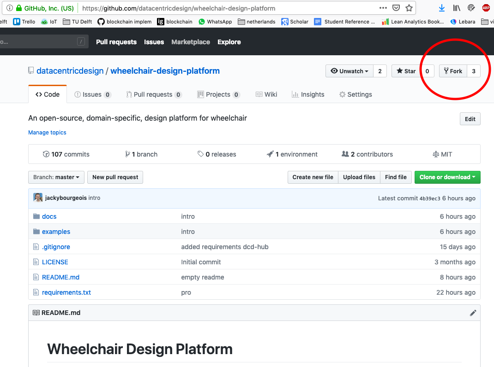

In the dialog, select your account (where you create the copy of the repository).


You now have a copy of the wheelchair-design-platform repository on your own account.

### 1.2 Add members to repo (only one member of the group)

Your repository is publicly accessible for reading. However, you need to give
the other members of the group access to this repository. On the top menu, click
*'Settings' > 'Collaborators'*. Search the username of your group members and add them.

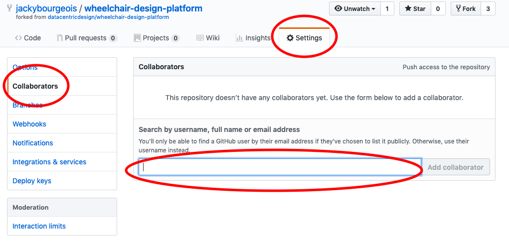

### 1.3 Create a project (only one member of the group)

GitHub offers a convenient way of managing your projects with a Kanban (scheduling system) style
board. On the top menu, click on 'Projects' and click on the green button 'New
Project'. Fill in a project name, select the template 'Basic Kanban' and click
'Create project'. You can use this space to map your tasks and your progress.

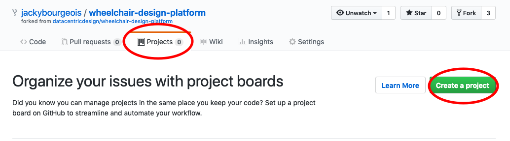

### 1.4 Clone repository (all group members)

*'When you create a repository on GitHub, it exists as a remote repository. You
can clone your repository to create a local copy on your computer and sync
between the two locations.'*
<a href="https://help.github.com/articles/cloning-a-repository/" target="_blank">(GitHub Help)</a>

On GitHub, at the top of your forked repository, click on the green button 'Clone or
download' and copy the provided link.

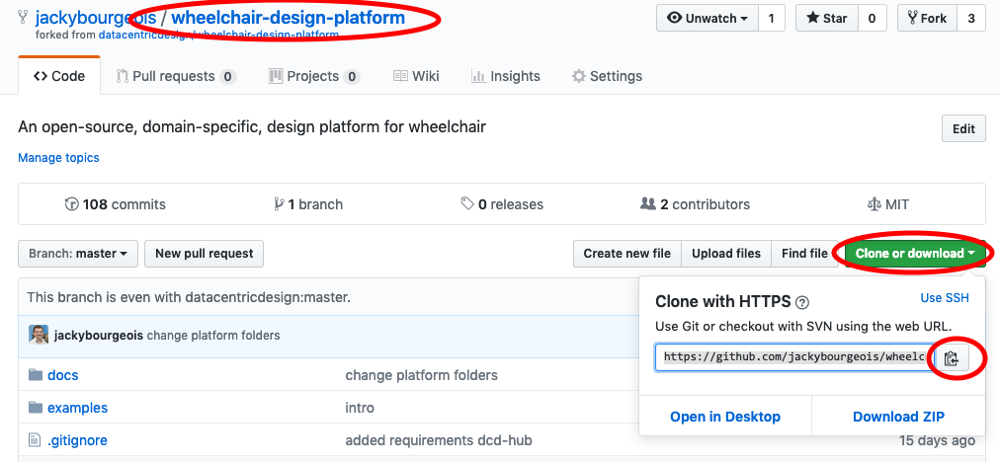

Go back to the Atom terminal, and type 'git clone' followed by the link you copied.
For example:

```bash
git clone https://github.com/example/wheelchair-design-platform.git
```

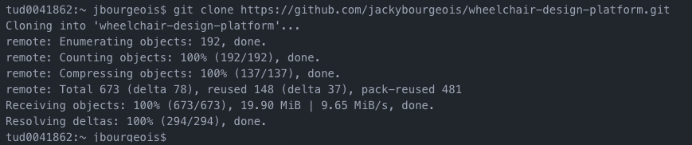

Let's tell Git who we are, by typing the following commands (enter these commands one after the other):

```bash
git config --global user.email "YOUR EMAIL ADDRESS"
git config --global user.name "YOUR NAME"
```


## 1.5 Project in Atom

To open the project you cloned, click on 'File' > 'Open Folder' on the top menu and
select the folder you cloned. On the left panel, you can see the files of your
project.


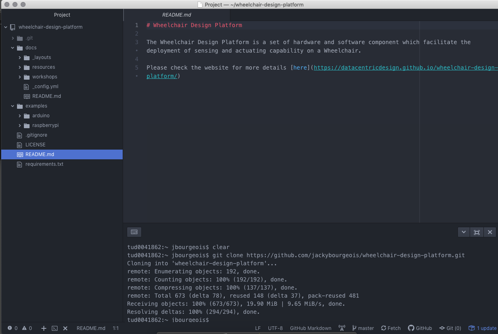

Let's have a closer look:

* The .git folder contains the full history of your project, managed by git. Do not
edit or delete files in this folder;
* The docs folder contains documentation and workshops;
* examples contains all code examples to get started;
* .gitignore contains the list of files/file extensions you do not want to track
with Git. It is especially convenient for local configuration or passwords not
to be shared;
* LICENSE contains the MIT license for this project;
* README.md contains a short introduction to the platform in Markdown. Markdown
is a lightweight markup language, i.e. minimal set tags to format text;
* requirements.txt contains the list of the python libraries you need to install for
the project to work;


Sign up as a group with an email address, a name and a password.

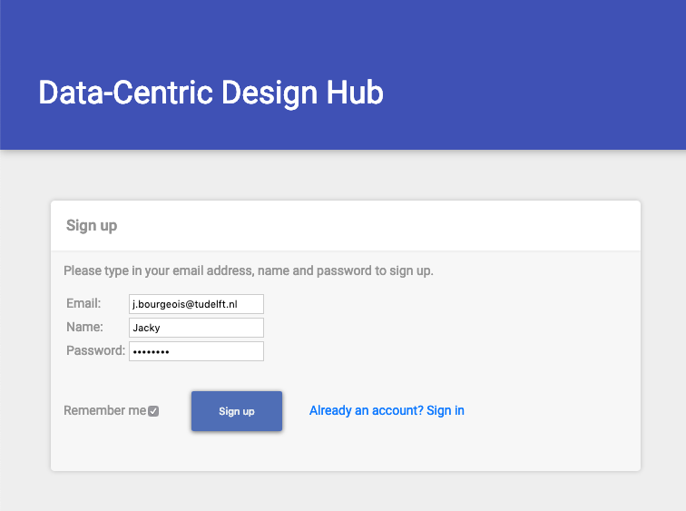

The sign up process creates an account, then the standard OAuth2 process starts
with a consent: you need to let the manager access your Things, so that it can
help you manage them. To do so click "Allow access".

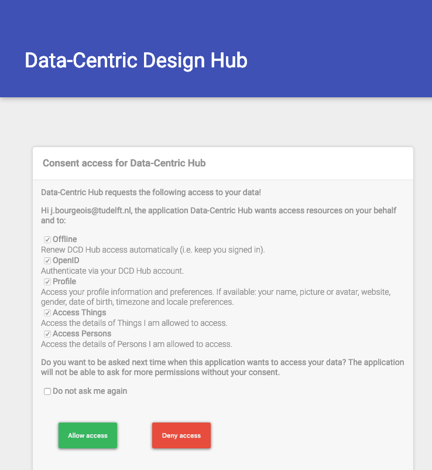

Once the consent succeeded, you can click on 'My Things' and create a first one.
For example with the name 'My wheelchair', type 'Wheelchair', and a
description 'An Internet-connected wheelchair'.

The process may take a few seconds, as the hub generates an access token for your Thing.

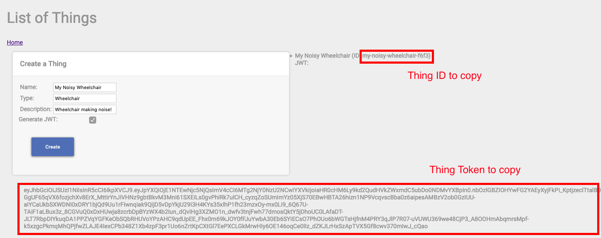

**COPY AND SAVE THIS TOKEN** in a text file, it will be shown only once and enables
your wheelchair to communicate with the hub. You can also save the thing id, but
you can always go back to the manager to retrieve this id.

Back to Atom and your project, let's create a first Python example.

## 3 Run Python Example

### 3.1 Dependencies

We use Pip to install the dependencies we need, listed in the file requirements.txt.
This file contains a dependence to the library writen for the Data-Centric Design
Hub as well as the a dependence for MQTT, a communication protocol we use to
talk to the hub.

Open the Atom terminal ('plus' sign in the bottom-left corner) and execute the following command.

On Mac:

```bash
pip3 install -r requirements.txt --user
```
On Windows:

```bash
python -m pip install -r requirements.txt --user
```

Here we 'install' the Python dependencies for our project. The option -r indicates we provide a file name that contains
the required dependencies, the option --user indicates we install the dependencies
in a dependency folder specific for the current users.

## 3.2 Environment Variables

On the left panel, right-click on the root folder "wheelchair-design-platform" > New Folder and name it 'wheelchair'.

Copy the file examples > raspberrypi > get_started.py
in your 'wheelchair' folder.

Opening this file, this Python code import the necessary library, then we can see
the following lines:

```python
THING_ID = os.environ['THING_ID']
THING_TOKEN = os.environ['THING_TOKEN']
```

In Python, it means we look at the environment variables to read the id and
access token of our thing. To provide these information as environment variable,
right click at the root of your project (left panel) and create a file '.env'.

In this file, type in the following and paste your id and access token after
the equal signs.

```bash
THING_ID=
THING_TOKEN=
```

Note: We do not want to track the file '.env' with Git as it contains secrets. To
avoid any mistake, the file .gitignore list all files, folders and extensions to
ignore. You will fine '.env' in the list.

## 3.3 Read through the Python Code

Going back to the get_started.py Python script, read through the code and comments
to capture the main steps:

* Create and connect a Thing to the Hub
* Retrieve and display the Thing details
* If the Thing is not containing any property, create a dumb property
* In any case, retrieve this dumb property
* Continuously call a method that generate dumb data and send them to the hub

Here are a few Python elements to note:

* Use # in Python to comment your code
* my_thing and my_property are variables
* To display information in the terminal, we use the method print()

```python
print("show text")
```

* Conditional statement: In Python we express the condition with 'if', elif
(else if) and else (more details
<a href="https://www.tutorialspoint.com/python/python_if_else.htm" target="_blank">here</a>.

In our case, we check if the thing details we retrieved from the server has no property
(a newly created Thing) and then create a dumb property.

```python
if len(my_thing.properties) == 0:
    # create a dumb property
```

* Indentation is key in Python. Take the previous example of condition, the indentation
defines what is in the condition. Any following line aligned with the if would be
considered outside the condition.

## 3.4 Execute the Python code

Let's execute this code. Go to the Atom terminal and type in the following command:

On Mac:

```bash
python3 wheelchair/get_started.py
```

On Windows:

```bash
python wheelchair\get_started.py
```

If the example runs properly you should see a log generated every two seconds,
indicating dumb data is being sent to the Hub.

## 3.5 Visualise Data on Grafana

To visualise this data, we use Grafana.

Go to the <a href="https://dwd.tudelft.nl/grafana" target="_blank">dwd.tudelft.nl/grafana</a>,
sign in with the provided login and password.

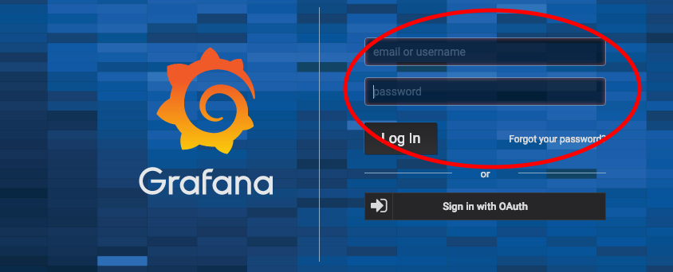

Click on the plus on the left panel.

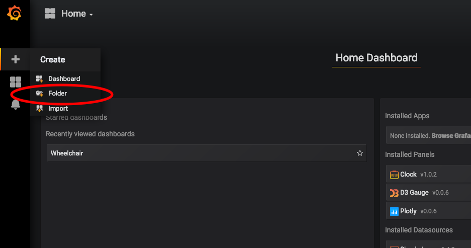

Create a new folder for your project.

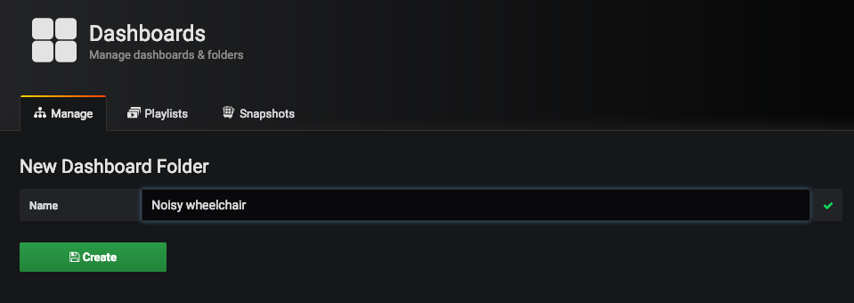

Then, click on the green button 'New Dashboard' to create a new Dashboard, and
select a new panel 'Graph'.

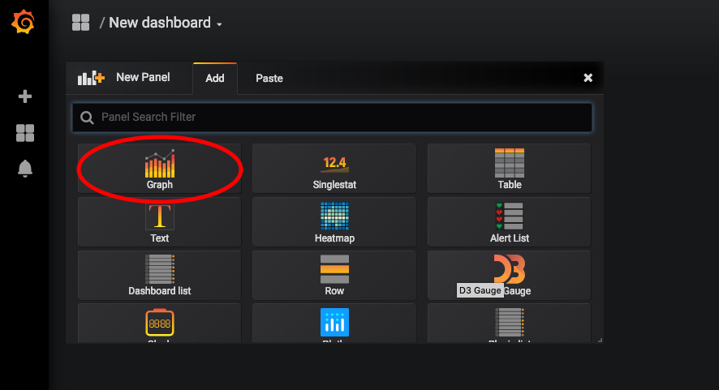

At the top of this new panel, click on 'Panel Title > Edit'

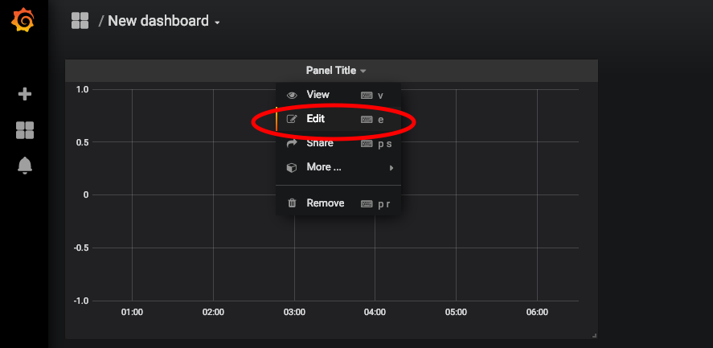

At the bottom, in the query element GROUP BY, click on time and 'remove'.

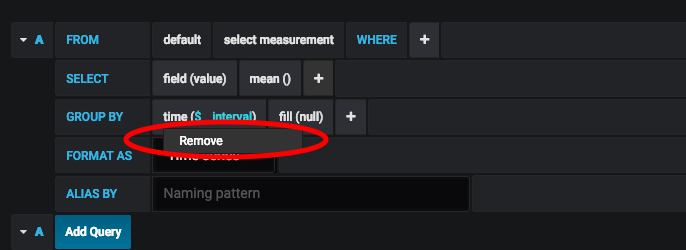

In FROM, click on 'Select Measurement' and select your Property ID. If your
Property ID is not appearing in the list, the hub is not receiving data from
your python code.

In SELECT, click on field and select Value1. Then click on the
plus > Fields > Field to add Value2 and Value3.


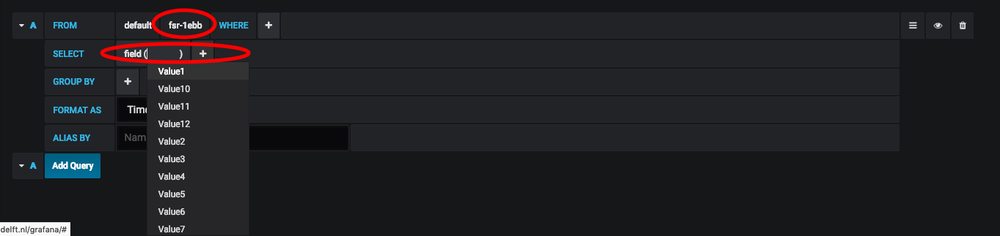

Back in the Atom terminal, stop your Python script with CMD+C (Ctrl+C).

# 4 Data Collection with Arduino

In this section we will log short and long press events of a push
button. It highlights that a sensor-based data point can be as simple as a button
event and tell us about how a user make use of it.

## 4.1 Push Button Example

In Atom, copy the folder examples > arduino > push_button_led_log
in your 'wheelchair' folder. Then, open this folder in Arduino IDE.

Looking at the code, we recognise the Arduino-like structure in three blocks:

* Declaration of variables and libraries, available throughout the code.
Note by convention, the constants are in uppercase (variables that will not change
during the programme) while other variables are in lowercase.

```cpp
int BUTTON_PIN = 22; // choose the input pin for the push button
int LED_PIN = 13;    // Choose the output pin for the LED

long LONG_PRESS_TIME = 500; // How long is a 'long press' (minimum, in ms)

long buttonActiveSince = 0; // Since when the button has been pressed (in ms since Arduino started)
boolean longPressActive = false; // Are we currently in a 'long press' event
```

* The setup() method executed once when the Arduino starts;

```cpp
void setup() {
  pinMode(BUTTON_PIN, INPUT);    // declare pushbutton as input
  pinMode(LED_PIN, OUTPUT);      // declare LED as input

  Serial.begin(9600); // setting baud speed for Serial (a baud is a pulse)

}
```

* The Loop() method executed infinitely after the setup method.
**WARNING** -  make sure to replace MY_PROPERTY_ID in this example with the ID of a property you created in Data-Centric Design hub.

```cpp
void loop() {
  // Is button active?
  if (digitalRead(button) == LOW) {
    // if the button was not yet pressed
    if (buttonActiveSince == 0) {
        buttonActiveSince = millis();
    } else if ((millis() - buttonActiveSince > LONG_PRESS_TIME)
                && longPressActive == false) {
          longPressActive = true;
          digitalWrite(led, HIGH);  // turn LED ON
        }
    }

  // Was button active?
  } else {
    // Was Long Press event?
    if (buttonActiveSince > 0) {
      // End Long Press event
      if (longPressActive == true) {
        Serial.println("MY_PROPERTY_ID,2");
        digitalWrite(led, LOW);  // turn LED OFF
        longPressActive = false;

      // End Short Press event
      } else {
        Serial.println("MY_PROPERTY_ID,1");
      }
      buttonActiveSince = 0;
    }
  }

}
```

In this example, we want to detect when a push button is pressed. We will trigger
two type of events when the button is released: 'short' or 'long' press.

The following flow chart illustrates the algorithm of this example code.


In the Arduino IDE, go in the top menu 'Tools > Boards', and  select 'Arduino/Genuino Mega or Mega 2560'

Then press the Verify button (green circle with tick).

## 4.2 Wire Push Button and LED

In this example we need three wires, a resistor, an LED and a push button.

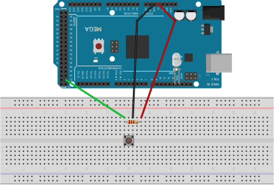

## 4.3 Connect Arduino

Use the USB cable to connect the Arduino to your laptop.

In Arduino IDE, in the top menu Tools > Port select your Arduino

Then press the Flash button to send the code into the Arduino (green circle with right arrow)

In the Arduino IDE, in the top menu 'Tools' open the 'Serial Monitor'.
Look at the input, pressing the push button should turn on the LED and produce a
log in the Serial Monitor.


## 4.4 Update Python Example

The last step is to adapt the Python code on your laptop to read the Serial input
from the Arduino and forward them to the Data-Centric Design Hub.

You can copy the code from examples/serial_example.py in your wheelchair folder.

In this code, we use the environment variable again to provide the thing id and token.

We need an extra environment variable(SERIAL) to specify the serial port. You can find
the port name for it on the Arduino IDE, in the top menu Tools > Ports. For example:

```bash
THING_ID=
THING_TOKEN=
SERIAL=MY_PORT_NAME
```

We are now ready to run the Python code

On Mac

```bash
python3 wheelchair/serial_example.py
```

On Windows

```bash
python wheelchair\serial_example.py
```

Go back to Grafana to visualise the inputs


# 5 Setting up the Raspberry Pi

The next step consists in setting up the RaspberryPi and running your code on it.

Insert the SD card in your laptop.

## 5.1 Set up an empty SD Card

__**(Skip this section if you have an SD Card with NOOBS pre-installed)**__

Download and install the software

Get the latest Raspbian here: https://www.raspberrypi.org/downloads/raspbian/

Unzip the file, you obtain an image file (extension .img)

To install this image on the SD card, download and install Etcher: https://www.balena.io/etcher/

Starting Etcher, you first select your image file, then your SD card, and 'Flash'.

# 5.2 Getting Started without Monitor

### 5.2.1 SSH

To connect to the Raspberry Pi without monitor, mouse and keyboard, we use directly
your laptop. To do this, we need to enable the 'ssh' protocol (for Secure Shell)
on the  Raspberry Pi. This protocol gives us the possibility to remotely access
a computer through the network. On your laptop, open text editor (TextEdit on Mac,
Editor on Windows) and save an empty file named 'ssh' (without extension) at the
root of the 'boot' disk (SD card). This file will indicate that we want to enable ssh.

### 5.2.2 Network Access

To connect your Raspberry Pi to the network, create a second file
'wpa_supplicant.conf' with the following content:

```bash
country=NL
update_config=1
ctrl_interface=/var/run/wpa_supplicant

network={
  ssid="YOUR_NETWORK_SSID"
  psk="YOUR_NETORK_PASSWORD"
}

```

Save this file on the 'boot' partition. Make sure that its extension is .conf rather
than .conf.txt (most texts editor will automatically add .txt or .rtf and hide it,
double-check that your file is not recognised as a text document).

To connect to Eduroam:

```bash
network={
  scan_ssid=0
  ssid="eduroam"
  key_mgmt=WPA-EAP
  eap=PEAP
  phase2="MSCHAPV2"
  identity="YOUR_EDUROAM_NETID"
  password="YOUR_EDUROAM_PASSWORD"
}
```

__**Disclaimer**__: this process requires to insert the Eduroam password. Thus, it is
important to protect the access to your Raspberry Pi. Make sure you apply ALL the
following steps marked as __**SECURITY**__

__**SECURITY**__ Disable auto-login: by default, anyone with an HDMI cable can look at
your Raspberry Pi and its files. Disable this feature

### 5.3 Booting and Connecting

__**DISCLAIMER:**__ If you do this workshop as part of a class, keep in mind that
all Raspberry Pi will have the same name on the network. You will have to power
your Raspberry Pi one after the other to be able to identify them.

Eject the SD card and insert it in on the Raspberry Pi, then power the Pi.

If the settings are correct, it takes about 30 seconds to get the Raspberry Pi on
the network. Make sure your laptop is connected to the same network, then connect
via ssh with the following command.

On Windows, you need to search for Windows Powershell and type the below command in there

On Mac

```bash
ssh pi@raspberrypi.local
```

In this command, 'pi' is the default username and raspberry.local is your default hostname (the
name of the Pi on the local network). You should type in your own username and hostname if you have changed it.

First you will need to type in 'yes' followed by Enter.

Then, you will be prompt for the default password. Type in 'raspberry'. Note:
when you type in the password, no letter appears in the terminal. This is the
normal behaviour to protect your password.

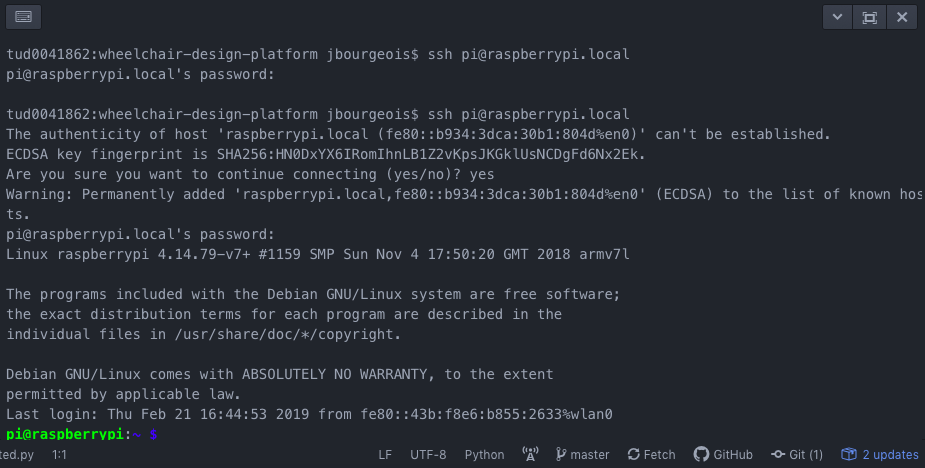

Once connected, we want to change the hostname, i.e. the name of your Raspberry Pi
on the network. By default, it is 'raspberrypi' which is not practical while you
have several of them (like in a classroom setting). To do this, we need to edit
two files /etc/hostname and /etc/hosts. We use the editor nano for this.

Type in:

```bash
sudo nano /etc/hostname
```

This command opens the file /etc/hostname in nano. Replace 'raspberrypi' with the
name of your choice (without space). In the following example, we use the
hostname 'noisy-wheelchair'.

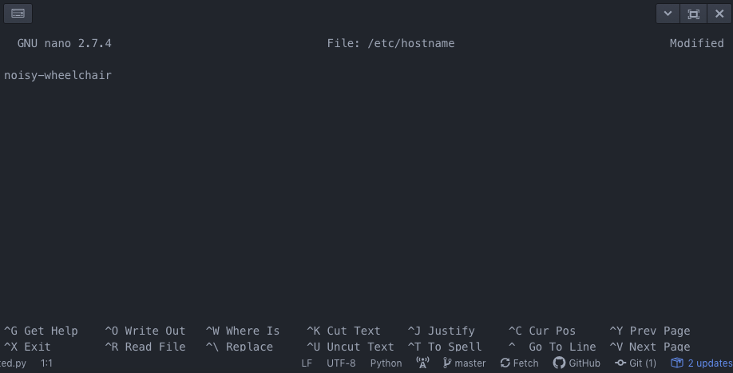

To save and exist, press Ctrl+X, press Y ()to answer 'Yes' to the question) followed
by Enter. Similarly, edit the file /etc/hosts and change 'raspberrypi' for the
same name, e.g. 'noisy-wheelchair'.

```bash
sudo nano /etc/hosts
```

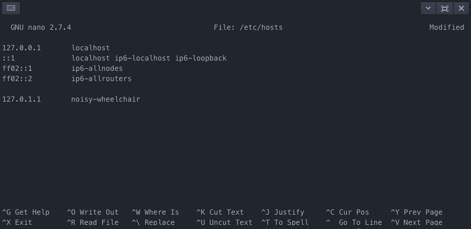

Again, save and exit with Ctrl+X, then Y followed by Enter.

Reboot your Rasberry Pi with:

```bash
sudo reboot
```

After about 30 second, you should be able to connect to you Raspberry Pi with
your new hostname. For example:

```bash
ssh pi@noisy-wheelchair.local
```

__**SECURITY**__ Next, we want to change the user password: changing the
default password 'raspberry' gives you more guaranty you are the only one
accessing your Raspberry Pi.

```
sudo passwd
```

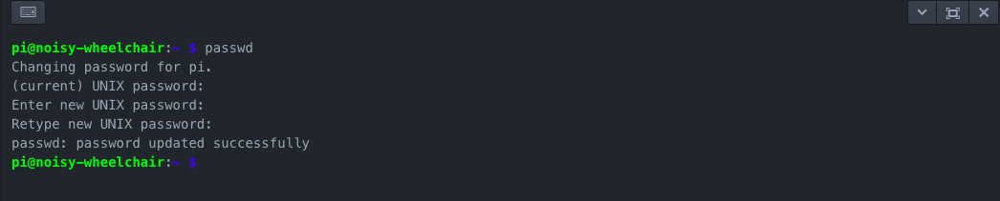

### 5.4 Installing Requirements

First, we need to update the Raspberry Pi with the latest version of its software.

```bash
sudo apt-get update
sudo apt-get upgrade
```

Set up Git

```bash
sudo apt-get install git
```

Clone your GitHub repository. Similarly to step 1.4, we now clone your repository.
This time, we clone it on the Raspberry Pi. For example:

```bash
git clone https://github.com/example/wheelchair-design-platform.git
```

In the terminal, to navigate through folder we use 'cd'. Enter the folder you have just
cloned with:

```bash
cd wheelchair-design-platform
```

Then, we need to create an .env file, in the project folder, with  THING_ID, the THING_TOKEN and the
SERIAL port.

```bash
nano .env
```

Copy your thing id and token, and use /dev/ttyUSB0 as a serial port (there are other serial ports on your raspberry pi you can try, such as ttyS0, ttyAM0).

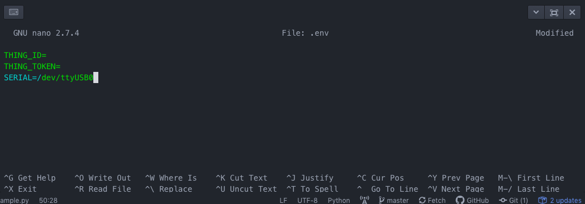

Install the requirements with Pip

```bash
python3 -m pip install -r requirements.txt --user
```


```bash
python3 wheelchair/serial_example.py
```

The result should be the same as running it on your laptop.
