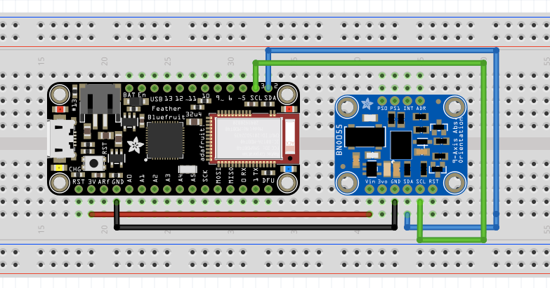
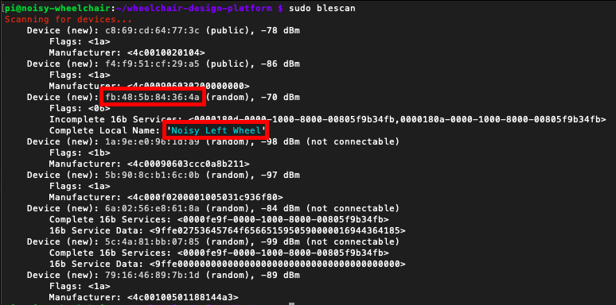

# Workshop 2: Integrating and Visualising Sensor-Based Data

1. [Orientation Sensor](#1-orientation-sensors)
2. [Feather Bluefruit](#2-feather-bluefruit)
3. [Bluetooth Low Energy (BLE) GATT Service](#3-bluetooth-low-energy-ble-gatt-service)
4. [Local Pre-Processing](#4-local-pre-processing)


## 1 Orientation Sensors

To get started with this second workshop, we propose to experience the principles
 and the capabilities of an orientation sensors. Go through the explanation and
 the examples we compiled for the BNO055: [Orientation Sensor](/resources/sensors/orientation)

## 2 Feather Bluefruit

With a better understanding of the BNO055, we can now apply these example on our
wheelchair to monitor the various movement of the wheel. As this part of the wheelchair
is mobile, we need a wireless connection to transmit information.

At this stage, there are three potential strategy:
1. Sending data directly to the cloud, via LoRa, 4G or WiFi;
2. Sending data to the Arduino Mega by setting up a Personal Area Network (PAN),
e.g. Bluetooth, Zwave, Zigbee.
3. Sending data to the Raspberry via WiFi or Bluetooth (Wireless capabilities of the Pi).

In this workshop we choose the third option, sending data to the Raspberry Pi via
Bluetooth. This strategy avoid implementing Bluetooth on the Arduino Mega, leveraging
the Raspberry Pi capabilities. We  also centralise the data before sending them
to the cloud, offering more flexibility.

On the wheel, we propose to implement the Feather 32u4, an Arduino-like, Bluetooth
enabled board by AdaFruit. Have a look at the documentation we compiled to get
an overview of its capabilities and set up your Arduino IDE: [Feather 32u4](/resources/feather)

## 3 Bluetooth Low Energy (BLE) GATT Service

As described in its resource page, the Feather 32u4 has a Bluetooth Low Energy (BLE)
communication capability. To communicate over BLE, we choose the GATT specification
(standing for Generic ATTribute Profile). It is implemented by most Bluetooth
consumer product and will enable our prototype to easily fit in its technology
landscape.

### 3.1 Exploring the Heart Rate Measurement (HRM) GATT Service

Let's run the example of GATT service Heart Rate Measurement (HRM) provided by Adafruit.
It is used by FitBits and alike to send HRM data to your phone.

Back to Arduino IDE, in the top menu select File > Examples > Adafruit BluefruitLE nRF51 > heartratemonitor.

At line 111, change the name 'Bluefruit HRM' to the name of your choice. This will
be the name of your device on the network.

Flash the code on the the Feather 32u4 and open the Serial monitor to observe
the initialisation process.

On your phone, search for 'ble gatt' in the app store and install 'nRF Connect'.
Open the app and scan for devices. The name you gave to your Feather 32u4 should
appear in the list. Click 'Connect' to connect on your Feather 32u4. The list of
GATT services should appear, including the Heart Rate Measurement. Click to open
this service and list its characteristic. Click on the triple arrow down to subscribe
to the Heart Rate Measurement characteristic. You should see the (random) heart
rate value sent by your Feather 32u4 every seconds.

We note the UUIDs of the service and characteristic (standing for Universally Unique
IDentifier), which are part of the standard GATT specification. In the next section
we will choose our own UUID for the orientation service because there is no specification
for such sensor.


### 3.2 Orientation data as GATT Service

Like most connected devices, the Feather rely on the
<a href="https://en.wikipedia.org/wiki/Hayes_command_set" target="_blank">Hayes commands</a>
to communicate over Bluetooth. These commands start with 'AT+'.

To implement a GATT service, the Feather 32u4 as a set of
<a href="https://learn.adafruit.com/introducing-adafruit-ble-bluetooth-low-energy-friend/ble-gatt" target="_blank">AT commands available</a>.
We will walk you through them as we transform the HRM example into an Orientation
GATT service.

At the top, we need extra libraries.

```cpp
#include <Wire.h>
#include <Adafruit_Sensor.h>
#include <Adafruit_BNO055.h>
#include <utility/imumaths.h>
```

We __**add**__ a sample rate to which we will send the orientation data (e.g. 200ms)
and we get the pointer to our BNO055 sensor.

```cpp
#define BNO055_SAMPLERATE_DELAY_MS (200)
Adafruit_BNO055 bno = Adafruit_BNO055(55);
```

We __**update**__ the name of the variable to avoid confusion. Instead of HRM we
have an IMU service and an orientation characteristic.

```cpp
int32_t imuServiceId;
int32_t orientationCharId;
```

We __**add**__ a method to initialise the BNO055.

```cpp
// Initializes BNO055 sensor
void initSensor(void) {
  if(!bno.begin()) {
    error(F("No BNO055 detected. Check your wiring or I2C ADDR!"));
  }
  delay(1000);
  bno.setExtCrystalUse(true);
}
```

At the beginning of setup(), we need to call this initSensor() so that our BNO055
is ready.

```cpp
   // Setup the BNO055 sensor
  initSensor();
```

At this stage, we __**update**__ the AT commands that setup our GATT service. first, we
change the device name to fit its purpose with AT+GAPDEVNAME.

```cpp
  if (! ble.sendCommandCheckOK(F("AT+GAPDEVNAME=Noisy Left Wheel")) ) {
    error(F("Could not set device name."));
  }
```

We __**update**__ AT+GATTADDSERVICE so that we no longer add an Heart Rate Measurment
service, but instead a custom service for our orientation sensor.

Here we choose the a 'random' UUID, which is any chain of 32 hexadecimal characters
(numbers and letters from A to F) that is not yet in the specification. We also
use __**UUID128**__ instead of __**UUID**__ to specify the 32 characters. This contrasts
with HRM, a service that is part of the GATT specification, and does not require the full
UUID.

```cpp
success = ble.sendCommandWithIntReply( F("AT+GATTADDSERVICE=UUID128=00-11-00-11-44-55-66-77-88-99-AA-BB-CC-DD-EE-FF"), &imuServiceId);
```

Similarly, we __**update**__ AT+GATTADDCHAR with a 'random' UUID.

* PROPERTIES 0x10 means it is an notification characteristic, to be subscribed
* MIN_LEN and MAX_LEN are the min and max number of bytes to be sent. A character
in encoded on 1 byte. We want to send data as a string of character such as
-0.00,-0.00,-.00 which represents 17 characters.
* VALUE is the default value sent when subscribing, in our case an empty string.

```cpp
  success = ble.sendCommandWithIntReply( F("AT+GATTADDCHAR=UUID128=02-11-88-33-44-55-66-77-88-99-AA-BB-CC-DD-EE-FF,PROPERTIES=0x10,MIN_LEN=1,MAX_LEN=17,VALUE=\"\""), &orientationCharId);
```

Once we are done with the setup, we write a function to sense and publish the three
orientation values on our orientation GATT service. We publish new values on an GATT
characteristic with the command AT+GATTCHAR.

```cpp
void orientation() {
  // Get Quaternion data (no 'Gimbal Lock' like with Euler angles)
  imu::Quaternion quat = bno.getQuat();
  float quatX = quat.x();
  float quatY = quat.y();
  float quatZ = quat.z();

  // Command is sent when \n (\r) or println is called
  // AT+GATTCHAR=CharacteristicID,value
  ble.print( F("AT+GATTCHAR=") );
  ble.print( orientationCharId );
  ble.print( F(",") );
  ble.print(String(quatX));
  ble.print( F(",") );
  ble.print(String(quatY));
  ble.print( F(",") );
  ble.println(String(quatZ));
}
```

Finally, the loop() is continuously calling orientation(), check for error and wait
the amount of time specify for the data collection frequency.

```cpp
void loop(void) {

  orientation();

  // Check if command executed OK
  if ( !ble.waitForOK() ) {
    error(F("Failed to get response!"));
  }

  // Delay before next measurement update
  delay(BNO055_SAMPLERATE_DELAY_MS);
}
```

The complete source code is available in
<a href="https://github.com/datacentricdesign/wheelchair-design-platform/tree/master/examples/communication/bluetooth/bno055_gatt" target="_blank">examples /
communication / bluetooth / bno055_gatt</a>

### 3.3 Wire and set up on the Wheel

We can see a simple wiring example using this board, together with an IMU (in our
case the BNO055):



Flash the code on the Feather 32u4 and connect to your orientation service from
your phone.

Set up the power bank and the breadboard on the wheel.

## 4 Python

The next step is to subscribe to the GATT service from the Raspberry Pi and push
the received data on the DCD Hub.

Let's connect to the Raspberry Pi and install the Bluetooth dependencies for Python.
Once logged on the Raspberry Pi, type in the following commands to install BLE dependencies.

```bash
sudo apt-get install bluez libbluetooth-dev

sudo pip3 install git+https://github.com/peplin/pygatt

sudo pip3 install "pygatt[GATTTOOL]"
```

We can use the command 'blescan' to scan the Bluetooth devices around. This way,
you can retrieve your Feather 32u4 with its name and identify its MAC address.

```bash
sudo blescan
```

Copy the MAC address and paste in your .env file as a new environment variable
'BLUETOOTH_DEVICE_MAC', for example:



```bash
BLUETOOTH_DEVICE_MAC=fb:48:5b:84:36:4a
```

Then, copy the example

```bash
cp examples/communication/bluetooth/subscribe_gatt_orentation.py wheelchair/
```

Let's have a look to this Python code. Has usual, we start by importing libraries
and loading environment variable (note the extra one for the Bluetooth MAC address).

Then we need to define which GATT service we want to connect to. Thus we create a
constant with the UUID of our orientation service.

```python
GATT_CHARACTERISTIC_ORIENTATION = "02118833-4455-6677-8899-AABBCCDDEEFF"
```

We define a 'handler', a method which will be called every time new data is coming
in for our orientation characteristic. In this method, we read the data, transform
the string into an array of three values, then update the property.

```python
def handle_orientation_data(handle, value_bytes):
    """
    handle -- integer, characteristic read handle the data was received on
    value_bytes -- bytearray, the data returned in the notification
    """
    print("Received data: %s (handle %d)" % (str(value_bytes), handle))
    values = [float(x) for x in value_bytes.decode('utf-8').split(",")]
    find_or_create("Left Wheel Orientation",
                   PropertyType.THREE_DIMENSIONS).update_values(values)
```

Finally, we use the pygatt library to connect to the device and subscribe to the
orientation characteristic.

```python
# Start a BLE adapter
bleAdapter = pygatt.GATTToolBackend()
bleAdapter.start()

# Use the BLE adapter to connect to our device
left_wheel = bleAdapter.connect(BLUETOOTH_DEVICE_MAC, address_type=ADDRESS_TYPE)

# Subscribe to the GATT service
left_wheel.subscribe(GATT_CHARACTERISTIC_ORIENTATION,
                     callback=handle_orientation_data)
```

## 5 Local Pre-Processing

To go further, you can have a look at the second example orientation_rotation which
show an example of a service with two characteristics.
