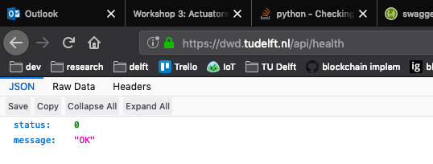

# Workshop 3: Actuators

In this workshop we lead you step-by-step to implement three actuators (vibration
motors, LEDs and speakers) from data, through Bluetooth and from the cloud.

1. [Rotation to Vibration](#1-nudging-for-recommended-limit)
2. [LED GATT Service on the Wheel](#2-internet-status-on-the-wheel)

## 1 Nudging for Recommended Limit

At the end of workshop 2, we were able to register to a BLE GATT service on the
Feather 32u4 placed on the left wheel of the wheelchair to receive orientation
and rotation data. In this step, we explore how we can use this information to
reason on the Raspberry Pi, and trigger action on the Arduino Mega.


### 1.1 Vibration pattern

Let's start with a look at the vibration motor describe here:
[Vibration Motor](../resources/actuators/vibration_motor.md)

Building on the couple of examples we provide, write your own vibration pattern.

### 1.2 Vibration Function

The next step is to transform this continuous pattern into a function that we
can turn on and off on demand. Thus, we create a function vibration_pattern() and
we move our code from loop() to vibration_pattern(). In loop, we call vibration_pattern()
and leave a delay between each loop. This transformation gives us the possibility
to implement multiple vibration patterns (one per function).

```cpp
void vibration_pattern() {
  if (increase) {
    i+=10;  // incrementing the power of the vibration motor
  } else {
    i-=10;
  }

  if ( i > 255) {
    increase = false;
  } else if ( i < 127) {
    increase = true;
  }
}

void loop() {
  vibration_pattern();
  delay(50);
}
```


### 1.2 Writing over Serial

Now that we have a function, we can better control whether the vibration motor is
on or off. Let's create a variable 'vibration_enabled' at the top of the file (next
to 'i' and 'increase') and set it to false.

```cpp
boolean vibration_enabled = false;
```

Then, in loop(), we want to listen to commands sent via the Serial connection (in this case
through the USB cable). We use Serial.read(), which gives us the last character received
via Serial. Let's define that sending:

* '1' means 'turn on'
* '0' means 'turn off'

For every loop, we check whether we receive a 1 or a 0 and change vibration_enabled
accordingly. This looks as follows:

```cpp
void loop() {
  char command = Serial.read();
  if (command == '1') {
    Serial.println("Turning on Vibration...");
    vibration_enabled = true;
  } else if (command == '0') {
    Serial.println("Turning off Vibration...");
    vibration_enabled = false;
    analogWrite(VIB_PIN, 0);
  }
  if (vibration_enabled) {
    vibration_pattern();
    analogWrite(VIB_PIN, i);
  }
  delay(50);
}
```

### 1.3 Control from Python

The next step is to control this vibration from Python. The following example
shows how to establish a serial connection and write (i.e. send) messages. In this
case, we send '1' (turning on the vibration) then wait for 5 seconds before sending
'0' (turning off the vibration). We wait another 2 seconds and start again.

```python
# Import required library
import os                       # To access environment variables
from dotenv import load_dotenv  # To load environment variables from .env file
import serial                   # To connect via the serial port
import time                     # To sleep for a few seconds

# The thing ID and access token
load_dotenv()

# Start reading the serial port
ser = serial.Serial(
    port = os.environ['SERIAL'],
    baudrate = 9600,
    timeout = 2)

while True:
    ser.write('1')
    time.sleep(5)
    ser.write('0')
    time.sleep(2)
```


### 1.4 Data-Driven Vibration

The final step is to control the vibration based on data. In this example, we will
nudge the wheelchair users when they reach their recommended number of wheel rotations.

To do this, we can start from the last example of workshop 2, which subscribes to
orientation and rotation GATT services from the wheel and sends the data to the DCD Hub.
We remove the subscription to orientation, which is not necessary in this case. We modify
the handler of rotation data so that we check whether we need to nudge the wheelchair user or not.

You can find a complete example in 
<a href="https://github.com/datacentricdesign/wheelchair-design-platform/blob/master/examples/actuators/vibrate_rotation_excess.py" target="_blank">
examples/actuators/vibrate_rotation_excess.py</a>


## 2 Internet Status on the Wheel

In this second part, we want to communicate the Internet connection status: is
the wheelchair connected to the cloud?

We will use an RGB diffuse LED as indicator on the wheel. The Raspberry Pi will
check for the Internet availability. We will create a BLE GATT service to WRITE
(i.e send) commands to the Feather 32u4 on the wheel, to turn on/off the LED 
depending on the internet status.


### 2.1 Diffused LEDs

The first step is to explore how to wire and control a NeoPixel 5mm Diffused LED.
This is described in the LED page in section 3:
[resources/actuators/leds](/resources/actuators/leds#3-neopixel-5mm-diffused-led)

### 2.2 Internet Connection status

In many case, checking the Internet connection is not enough, we want to know
whether the cloud we rely on is currently available. Most cloud services have 
a 'health' API in order to check if the service is available and running fine.
For the DCD Hub, it is /health, you can try in your web browser:

<a href="https://dwd.tudelft.nl/api/health" target="_blank">https://dwd.tudelft.nl/api/health</a>

The result should look as follows:



Notice the two information of the result, a status number (0 if everything is running
properly) and a message. Let's create a Python script that runs this HTTP request
to check the DCD Hub status. In your wheelchair folder, create a file dcd_hub.py
and write the following code.

```python
import requests

def dcd_hub_status():
    """
    Return the DCD Hub status:
    - 0: Connection successful
    - 1: Could not reach the hub (Connection or Hub issue)
    """

    uri = "https://dwd.tudelft.nl/api/health"
    try:
        json_result = requests.get(uri).json()
        if json_result["status"] is 0:
            # We received a response with status = 0, everything is fine
            return 0
        # In any other case, there is a issue
        return 1
    except Exception as e:
        # Show some information about the error
        print(str(e))
        # Return 1, the connection wasn't successful
        return 1
```

This code import the 'requests' library, convenient to make a HTTP request. We
declare a function dcd-hub_status() which try to call the health API and return 
0 if it succeed. If it failed because of the Internet connection or the availability
of the Hub, then it return 1.

try/except (also known as try/catch in other languages) is a construction that makes
your code more robust. You define in the 'try' something that work but sometimes
can fail. In our case, firing an HTTP request fails if there is no Internet
connection. If the code in the try clause fails, then the except clause is executed.
In our case, we print the error and return '1', avoiding our code to crash.

Notice we create this function in a separate file. Doing so give you the opportunity
to import it anywhere in your code without rewriting nor copy/pasting it.

### 2.3 GATT Service for Control

For this step we will need the latest version of our Feather's firmware. The
firmware is software that is embedded in a piece of hardware, typically provided
by its manufacturer. Adafruit provides a convenient way to update it with an
Android or iOS app:
<a href="https://learn.adafruit.com/adafruit-feather-32u4-bluefruit-le/dfu-bluefruit-updates" target="_blank">
https://learn.adafruit.com/adafruit-feather-32u4-bluefruit-le/dfu-bluefruit-updates</a>

Then, open examples/communication/bluetooth/gatt_write in the Arduino IDE. This 
code is an example of GATT service enabling to WRITE (i.e. the Feather receive
data) in contrast with the previous section in which we were READ (i.e. the
Feather was sending data). Read through the code to understand what it does, then
flash it on the Feather.

On the Raspberry Pi, you can run examples/communication/bluetooth/write_gatt.py
This code connect to your Feather via Bluetooth and use the code discussed previously
to check the connection. If the connection with the DCD Hub can be established, it
writes on the LED GATT service to turn on the LED, otherwise it writes to turn off
the LED. 
