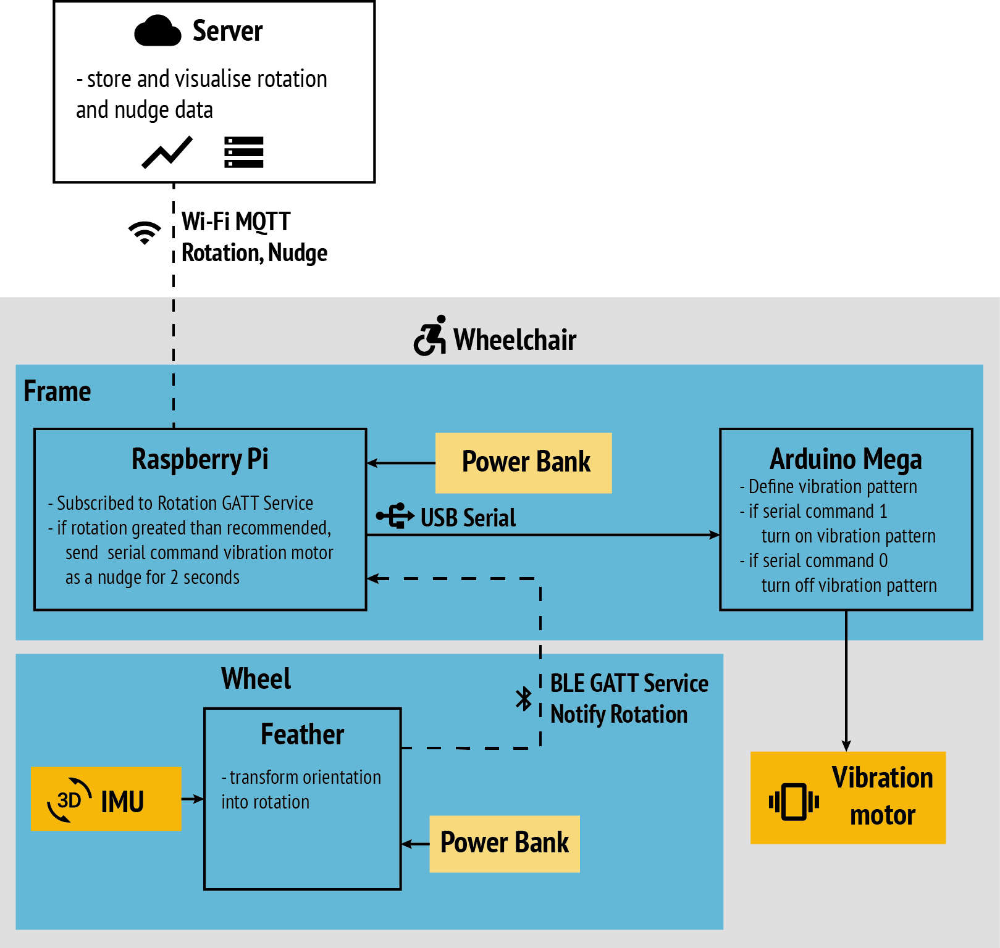
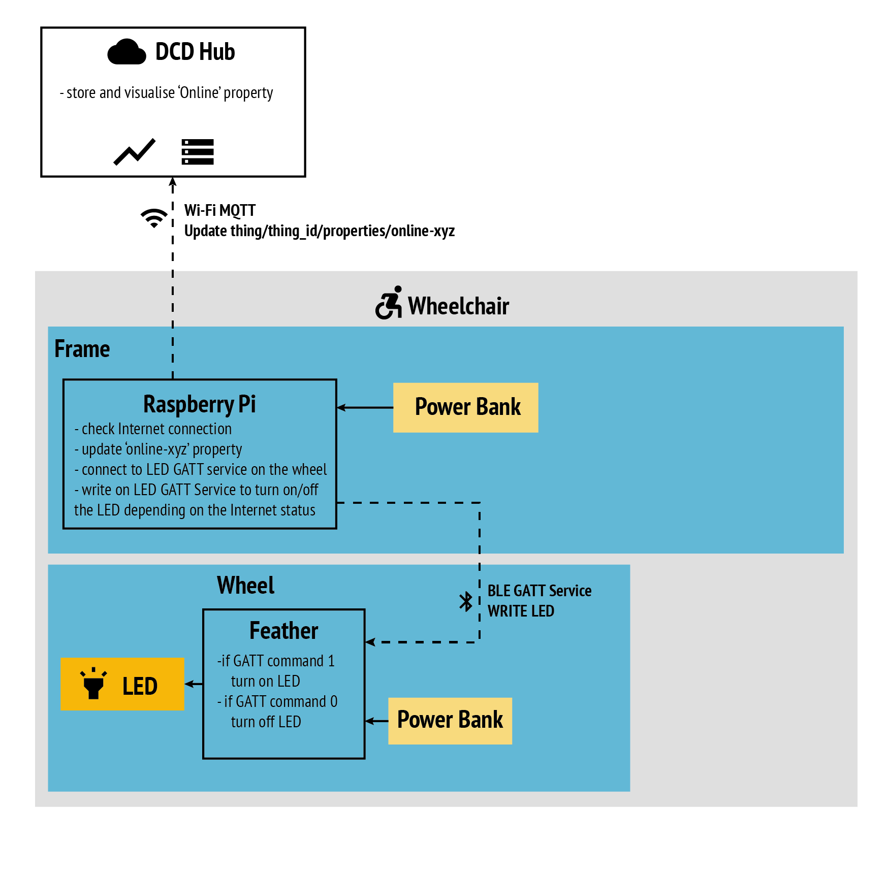

# Workshop 3: Actuators

In this workshop we lead you step-by-step to implement three actuators (vibration
motors, LEDs and speakers) from data, through Bluetooth and from the cloud.

1. [Rotation to Vibration](#1-rotation-to-vibration)
2. [LED GATT Service on the Wheel](#2-led_gatt_service-on-the-wheel)
3. [MQTT Subscription to Speaker](#3-mqqt-subscription-to-speaker)

## 1 Rotation to Vibration

At the end of workshop 2, we were able to register to a BLE GATT service on the
Feather 32u4 placed on the left wheel of the wheelchair to receive orientation
and rotation data. In this step, we explore how we can use this information to
reason on the Raspberry Pi, and trigger action on the Arduino Mega.



### 1.1 Vibration pattern

Let's start with a look at the vibration motor describe here:
[Vibration Moto](../resources/actuators/vibration_motor.md)

Building on the couple of example we provide, write your own vibration pattern.

### 1.2 Vibration Function

The next step is to transform this continuous pattern into a function that we
can turn on and off on demand. Thus, we create a function vibration_pattern() and
we move our code from loop() to vibration_pattern(). In loop, we call vibration_pattern()
and leave the delay between each loop. This transformation gives us the possibility
to implement multiple vibration pattern (one per function).

```cpp
void vibration_pattern() {
  if (increase) {
    i+=10;  // incrementing the power of the vibration motor
  } else {
    i-=10;
  }

  if ( i > 255) {
    increase = false;
  } else if ( i < 127) {
    increase = true;
  }
}

void loop() {
  vibration_pattern();
  delay(50);
}
```


### 1.2 Writing over Serial

Now that we have a function, we can better control whether the vibration motor is
on or off. Let's create a variable 'vibration_enabled' at the top of the file (next
to 'i' and 'increase') and set it to false.

```cpp
boolean vibration_enabled = false;
```

Then, in loop() we want to listen to command sent via Serial connection (in this case
through the USB cable). We use Serial.read(), which gives us the last character received
via Serial. Let's define that sending:

* '1' means 'turn on'
* '0' means 'turn off'

For every loop, we check whether we receive a 1 or a 0 and change vibration_enabled
accordingly. This looks as follows:

```cpp
void loop() {
  char command = Serial.read();
  if (command == '1') {
    Serial.println("Turning on Vibration...");
    vibration_enabled = true;
  } else if (command == '0') {
    Serial.println("Turning off Vibration...");
    vibration_enabled = false;
    analogWrite(VIB_PIN, 0);
  }
  if (vibration_enabled) {
    vibration_pattern();
    analogWrite(VIB_PIN, i);
  }
  delay(50);
}
```

### 1.3 Control from Python

The next step is to control this vibration from Python. The following example
show how to establish a serial connection and write (i.e. send) message. In this
case, we send '1' (turning on the vibration) then wait for 5 seconds before sending
'0' (turning off the vibration). We wait another 2 seconds and start again.

```python
# Import required library
import os                       # To access environment variables
from dotenv import load_dotenv  # To load environment variables from .env file
import serial                   # To connect via the serial port
import time                     # To sleep for a few seconds

# The thing ID and access token
load_dotenv()

# Start reading the serial port
ser = serial.Serial(
    port = os.environ['SERIAL'],
    baudrate = 9600,
    timeout = 2)

while True:
    ser.write('1')
    time.sleep(5)
    ser.write('0')
    time.sleep(2)
```


### 1.4 Data-Driven Vibration

The final step is to control the vibration based on data. In this example, we will
nudge the wheelchair users when they reach their recommended number of wheel rotation.

To do this, we can start from the last example of workshop 2, which subscribe to
orientation and rotation GATT services from the wheel and send the data to the DCD Hub.
We remove the subscription to orientation, not necessary in this case. We modify
the handler of rotation data so that we check whether we need to nudge or not.

You can find a complete example in 
<a href="https://github.com/datacentricdesign/wheelchair-design-platform/blob/master/examples/actuators/examples/actuators/vibrate_rotation_excess.py" target="_blank">examples/actuators/vibrate_rotation_excess.py</a>


## 2 LED GATT Service on the wheel

In this second section, we want to control an RGB diffused LEDs placed on the wheel.
This time we will explore how to subscribe to an MQTT topic and receive messages
from the cloud. Updating an LED property in the DCD Hub manager, the Raspberry Pi
will thus receive this update. We will create a BLE GATT service to WRITE (i.e send)
command to the Feather 32u4 on the wheel, to turn on the LED.



### 2.1 Diffused LEDs


### 2.2 GATT Service for Control


### 2.3 MQTT Subscription to LED


## 3 MQTT Subscription to Speaker

### 3.1 MQTT Subscription

### 3.2 Playing sound on the Raspberry Pi