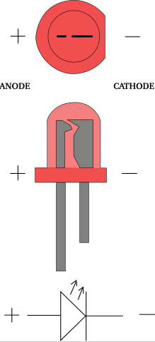
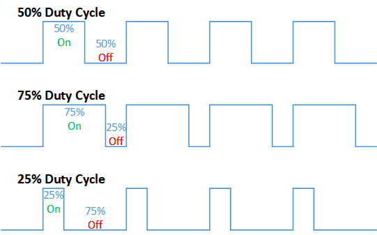
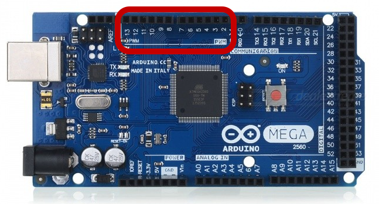
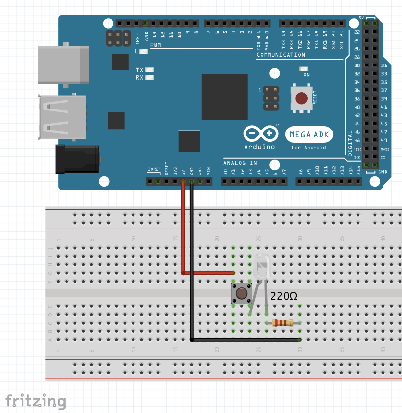
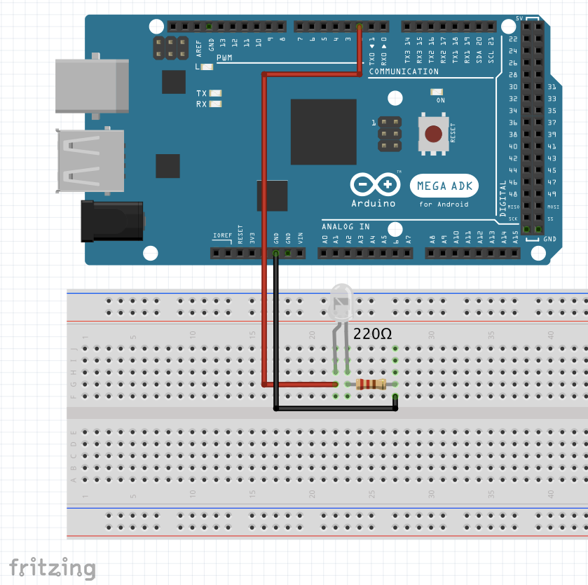
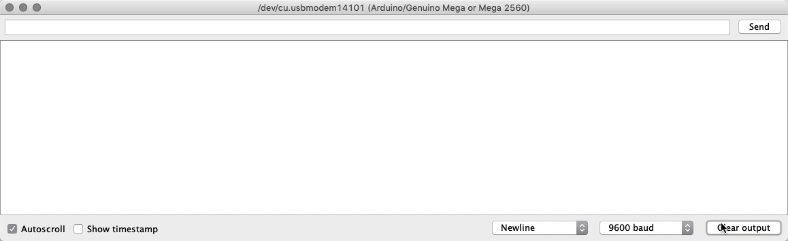
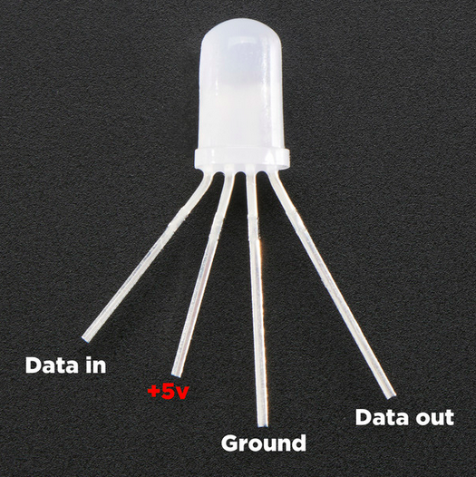
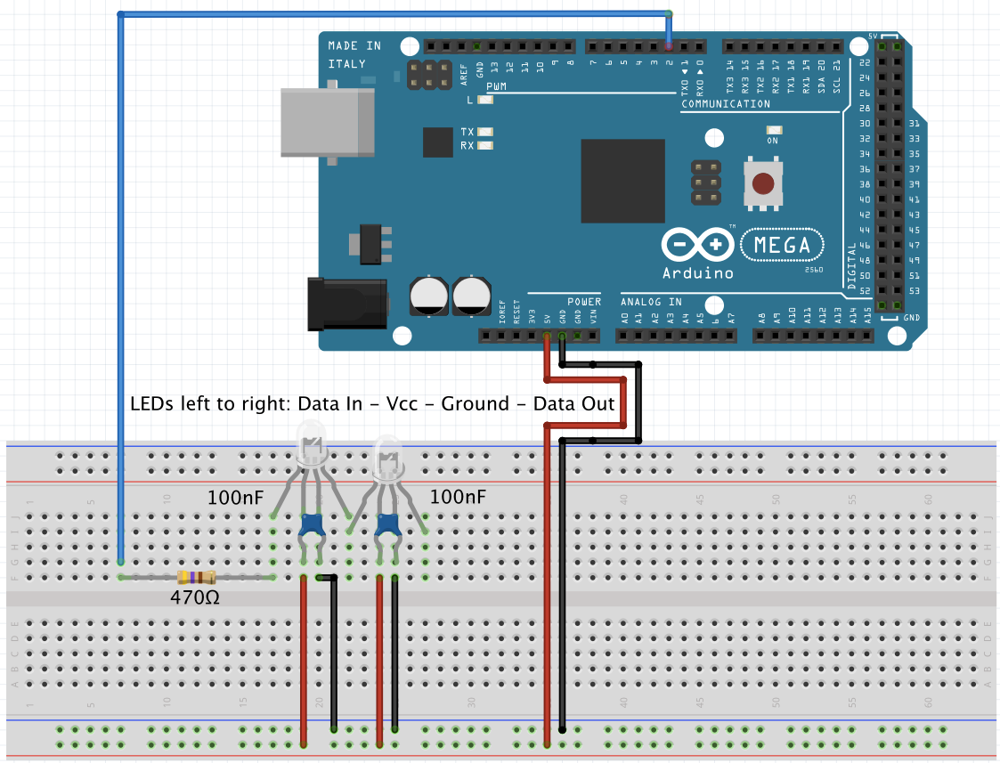
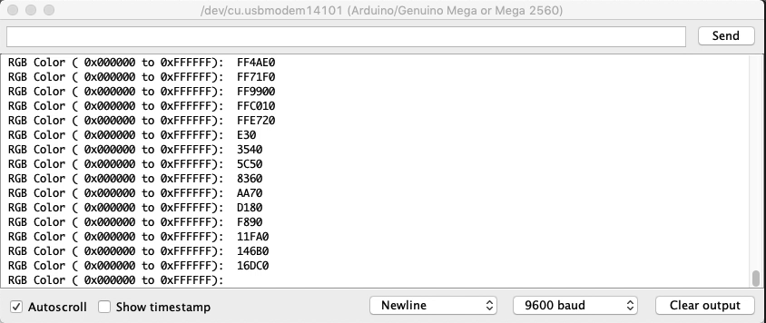

# LEDS and Buttons

## LEDs
An LED is a type of diode that emits light. A diode is, simply, a device that lets current go through it in one direction, but resists it in the other. To pass current through the diode in the direction it does not resist (anode to cathode), you need to supply some voltage to it. An LED normally spends from 1.8 to 3.3 volts, depending on the particular type, this is called its voltage drop or forward voltage. The current that the LED spends nominally is called forward current.  With LEDs you have to be careful  to not supply too much current to an LED, or else you might fry it!.
That's why you'll see that normally you have a resistor in series with the LED, to assure that not too much current goes through it.

By knowing the forward current and voltage of an LED, and the available power source's voltage, you can calculate how big the resistor you apply in series should be. the formula is a simple derivation of Ω's law (V = RI).

Rs = ( Vcc - Vf ) / If
1. Rs = Resistance in series with LED;
2. Vcc = power source's voltage;
3. Vf = forward  voltage of the LED;
4. If = forward current of the LED.

If you have several LEDs in series with similar forward currents, you can simply replace Vf with the sum of all forward voltages of the LEDs.

## Pushbutton Switch
A pushbutton switch, is a very simple electronic device with 4 pins. When left to itself (open), there is no electrical connection between the two sets of pins. When a switch is pressed, it will close its metallic contact on the two sets of pins, thus allowing current to pass between the 2 sets of 2 pins.

Here's a brief schematic (note, a set of pins means those pins are always connected, you can see the sets in black, and the mechanism to join them electrically when you press the button in red):

## PWM

The last thing we should know with LEDs, is that you can not only turn them on and off, but also vary their intensity.
You can do so by controlling the voltage supplied to the LED, but that is a morose and finicky process. Instead, you can use a technique called PWM,(Pulse Width Modulation); in which, instead of always powering the LED at full blast, we providing a very high frequency square wave of voltage, in which the pulses  are such that, on average, the device is x% on, and 100-x% off.  Such is termed the duty cycle. (a duty cycle of 50% means the signal is 50% on, and 50 % off, in average).

By doing this, we are alternating between having the LED on, and off, but so quickly that our eyes "average" the result!
So an LED with a duty cycle of 25% looks 25% as bright as the normal LED!
Notice that all of this is done digitally, so, essentially PWM is a way of getting analog like results with digital means.

You can use PWM with the pins that have the tag PWM in Arduino, and can use the function analogWrite() for establishing the duty cycle on a pin that can use PWM, with a value from 0 (0%) to 255 (100%).

Below, you can see the pins you can use with PWM!

## Examples

Let's do some examples with the types of LEDs (and buttons) we have.

### Simple LED with button switch.

We'll be making a simple circuit to turn on the LED, with the help of the push button.

We'll be using a simple LED, so lets use a 220Ω resistor (this will work just fine for a most LEDs), together with the 5v output of the Arduino.

#### Schematic:

### Simple LED with Pulsing intensity using PWM
We'll make a simple circuit to make a pulsing LED, with the help of some code this time!
####Schematic:

#### Result

### NeoPixel 5mm Diffused LED
This is a special type of LED with 24bit color which gives 256 intensities for R, G and B, allowing for a lot of colors.
This requires the use of the NeoPixel library for Arduino.

Lets see the pins and what they're for:

1. Data In, where we connect our arduino data pin (and a 470 Ω resistor);
2. Vcc input pin, (5v);
3. Ground;
4. Data out, where we can chain several NeoPixel LEDs together(simply connect the data in port of one to the data out of the other).

#### Important Notes
* When connecting several NeoPixels Through-the-hole individual LEDs in a chain, it is advisable to add a 0.1 µF capacitor between the + (Vcc) and – (Ground) pins of *EACH PIXEL*.

* Adding a ~470 Ω resistor between your microcontroller's data pin and the data input on the first NeoPixel LED can help prevent voltage spikes on the data line that can damage it. Also the Arduino shouldn't be able to power more than a few(8 ~ish) NeoPixels directly from the 5V pin.

* After 1-2 meters distance from the Arduino to the first NeoPixel, the signal starts to degrade, and becomes unreliable.

* Avoid connecting NeoPixels to a live circuit. If you must, always connect ground first, then +5V, then data. Disconnect in the reverse order.

* If powering the pixels with a separate supply, apply power to the pixels before applying power to the microcontroller.

* NeoPixels powered by 5v require a 5V data signal. If using a 3.3V microcontroller you must use a logic level shifter

* If your microcontroller and NeoPixels are powered from two different sources (e.g. separate batteries for each), there must be a ground connection between the two.

#### Schematic
This example was made with two LEDs, you can of course choose how many you want, taking care you're feeding them enough current and voltage.

#### Result
This is how your serial should look like!

