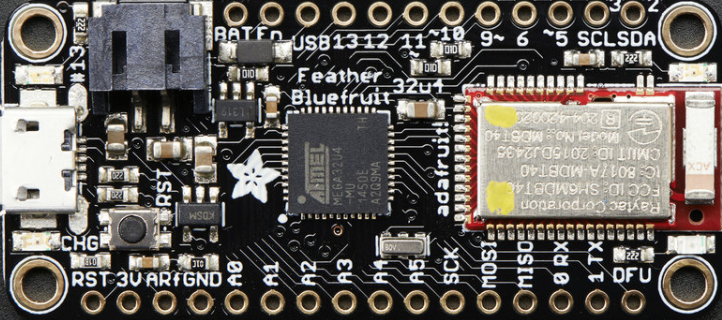

## Adafruit Feathers
The Adafruit Feather is a complete line of development boards that are both standalone and stackable.

### Bluetooth
Bluetooth is a wireless technology standard for exchanging data over short distances using short-wavelength UHF radio waves (ISM band of the wave spectrum - from 2.400 to 2.485 GHz).
From these waves, that originate from fixed and mobile devices, PANs (personal area networks) are built.

**BTLE**
Bluetooth Low Energy is a new low-power, 2.4GHz spectrum wireless protocol. In particular, its the only wireless protocol that you can use with iOS without needing special certification and it's supported by all modern smart phones. This makes it excellent for use in portable projects that will make use of an iOS or Android phone or tablet. It also is supported in Mac OS X and Windows 8+.
#### PANs
A personal area network (PAN) is a computer network for interconnecting devices centered on an individual person's workspace. A PAN provides data transmission amongst devices such as computers, smartphones, tablets and personal digital assistants.

PANs can be used for communication amongst the personal devices themselves, or for connecting to a higher level network and the Internet where one master device takes up the role as gateway. A PAN may be wireless or carried over wired interfaces such as USB.

A wireless personal area network (WPAN) is a PAN carried over a low-powered, short-distance wireless network technologies such as Bluetooth. The reach of a WPAN varies from a few centimeters to a few meters.

#### Adafruit Feather 32u4 Bluefruit
The Adafruit Feather 32u4 Bluefruit is an 'all-in-one' Arduino-compatible + Bluetooth Low Energy(BLTE) board with built in USB and battery charging. It's an Adafruit Feather 32u4 with a BTLE module.

