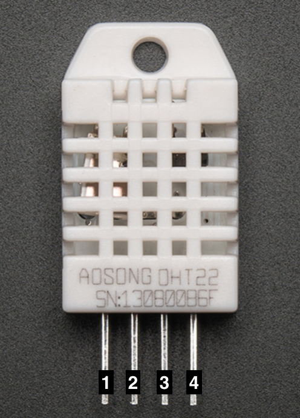
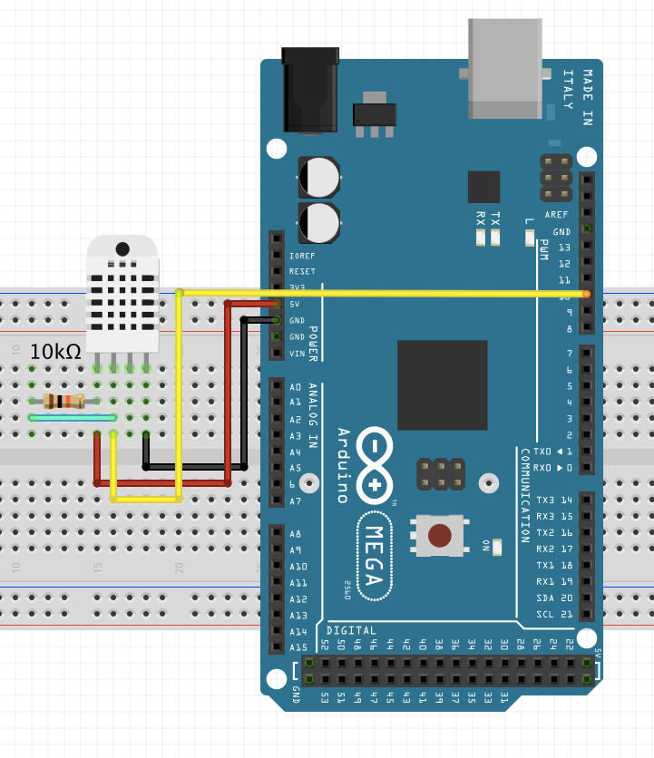
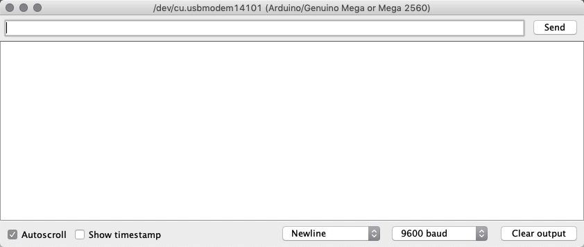

# DHT22 (Humidity and temperature sensor)

This basic, low cost digital sensor is simple to use, outputting digital signal data on the data pin, however, you can only get new data from it every 2 seconds. It requires no analog inputs.

If you are connecting several, each must have its own data pin.

##Technical Details
Please use a 4.7 - 10 kΩ medium strength pullup resistor between pins 1 and 2.  

* **Pins**
  1. Vcc, connect to 5V;
  2. Data Output pin  (digital);
  3. Not used;
  4. Ground.

* **Characteristics**
  * 3-5 V power and I/O;
  * 0 to 100% humidity readings range (2-5% accuracy);
  * -40˚ to 80˚ temperature readings range (±.5˚ accuracy);
  * Sampling rate 0.5Hz (2 secs per new data point).

## Examples
To use this sensor with the Arduino, please install the following libraries;
* Adafruit Unified Sensor;
* DHT sensor library.

### Simple Humidity and temperature reader
#### Schematic
Here's how our example circuit is going to look like:

#### Results
Lets see how the console will look with the finished example:

