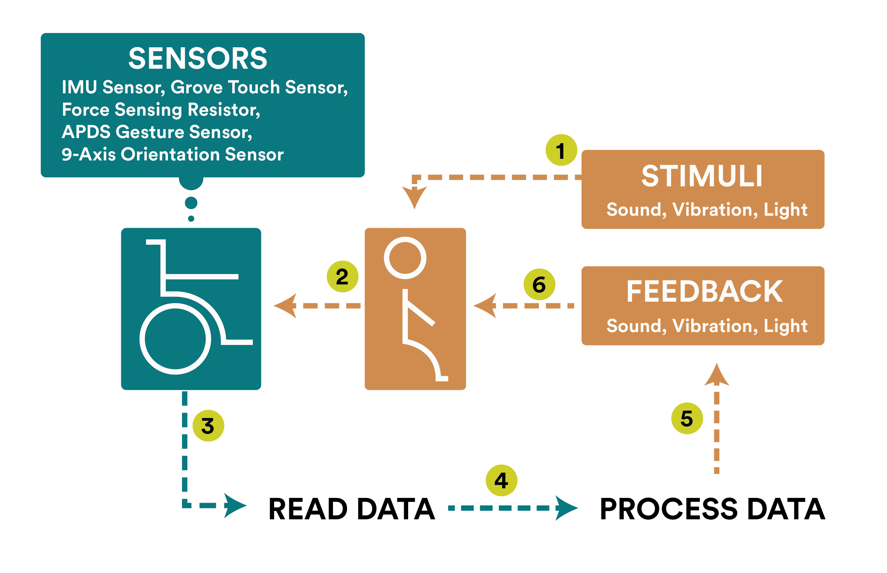

# Assignment 2 - Wheelchair Design

The second assignment focuses on selecting and implementing the sensors on the wheelchair. Afterwards a collection of samples will be obtained with Grafana. Finally, actuators will be explored and 3 actuators will be described with their behaviour and the motivation to use in our project.

## Grafana dashboard with samples of data

## Actuator exploration
The  actuators we will be using are: LED strips, A vibration motor and speakers. Using these actuators, we can tell the users how to move and give them feedback on if the moved correctly.

Actuators | Behavior | Info on the context
--- | --- | ---
*LED strips* | Changes the light attributes of the environment | Improves the dance environment by making the it feel like a dancehall. And they give feedback to wheelchair user if he or she did the right move
*Vibration Motor* | Vibrate based on the change of the user’s movement | Feedback for the user notifying the status of their dance movement
*Speaker* | Auditory output | Plays the music and tells the user how to move

## Wheelchair plan
To make everything work, certain elements are expected to work in a certain order. Firstly, we start with stimuli given to the user (1). This can consist of light, sound and vibrations. After that the user takes action based on this stimuli (2) and the data is being read (3). This data will be processed (4) to see how the user performed and based on that feedback (5) will be created. This feedback is given to the user (6).

